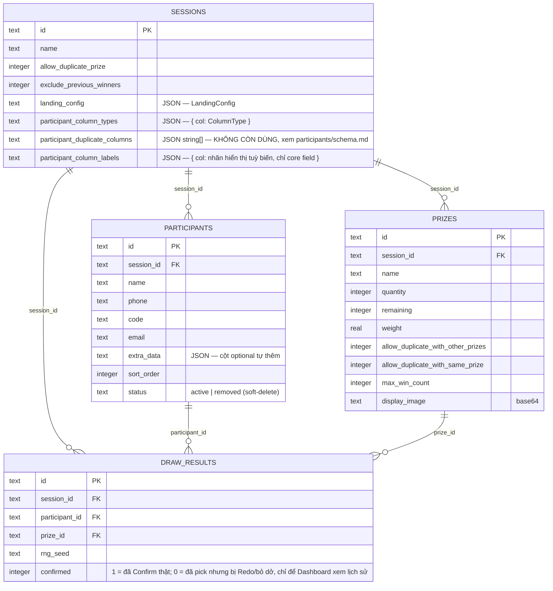

# SQLite schema + chiến lược migration

> Chi tiết riêng cho `participants` (cột `extra_data`, 2 tầng field, `participant_column_types`...)
> xem [`docs/participants/schema.md`](../participants/schema.md) — file này là bức tranh toàn bộ 4
> bảng + cách viết migration an toàn.



`electron/db.ts` là nơi DUY NHẤT chứa schema + migration. Pattern lặp lại cho MỌI migration trong file này (xem `migrateSessionColumnTypes`, `migrateParticipantSortOrder`...):

```ts
function migrateXxx() {
  const cols = (db.prepare(`PRAGMA table_info(<table>)`).all() as { name: string }[]).map((c) => c.name);
  if (!cols.includes("<cột mới>")) {
    db.exec(`ALTER TABLE <table> ADD COLUMN <cột mới> <type>`);
  }
}
migrateXxx(); // gọi ngay dưới định nghĩa, chạy mỗi lần app khởi động
```

An toàn khi chạy lại nhiều lần (idempotent — luôn kiểm tra cột đã tồn tại chưa trước khi `ALTER`), không bao giờ `DROP`/mất dữ liệu cũ. Khi cần đổi CẤU TRÚC bảng (không chỉ thêm cột — vd bỏ ràng buộc `UNIQUE` toàn cục), pattern là: tạo bảng `_new`, `INSERT ... SELECT` copy dữ liệu cũ sang, `DROP` bảng cũ, `RENAME` bảng mới về tên cũ (xem `migrateToPerSessionData`, đổi từ participants toàn app dùng chung sang participants theo từng session).

**Trước khi sửa `db.ts`**: luôn hỏi lại người dùng nếu thay đổi liên quan tới schema — không được viết migration phá dữ liệu người dùng đã có (xem `CLAUDE.md` mục "Việc cần hỏi lại trước khi làm").
