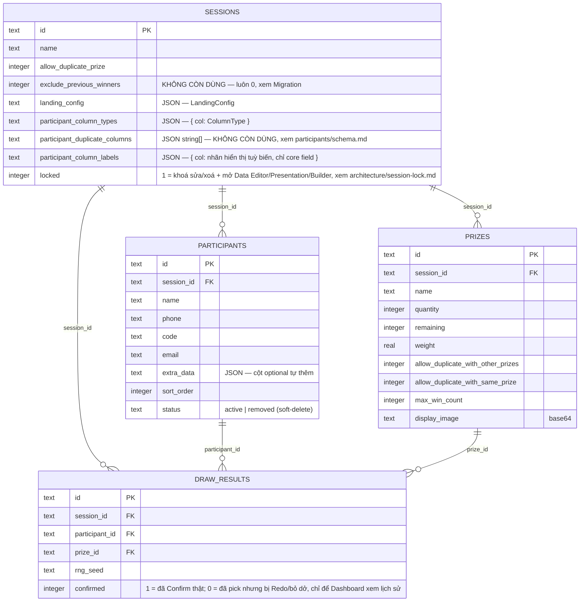

# SQLite — lưu trữ theo session, schema, migration

> Chi tiết riêng cho `participants` (cột `extra_data`, 2 tầng field, `participant_column_types`...)
> xem [`docs/participants/schema.md`](../participants/schema.md).

## Lưu trữ theo session — mỗi session là 1 file

Mỗi session (tab) là **đúng 1 file SQLite** trong thư mục `data/`. Copy 1 file sang `data/` của máy
khác là có y nguyên session đó — participants, prizes, landing page, lịch sử quay.

```
data/
├── Hoi-cho-thang-10__3f9a1c2e.db      ← 1 session
├── Minigame-FB__8b20d7aa.db           ← session khác (trùng tên session cũng được)
├── lucky-draw.db.migrated-….bak       ← bản sao lưu DB kiểu cũ (nếu từng có)
└── .trash/                            ← tab đã xoá / bản trùng không chọn (không xoá hẳn)
```

| Cách chạy | Thư mục `data/` |
|---|---|
| Dev, bản Setup Windows, `.app` trong Applications | `<userData>/data/` — Windows `%APPDATA%\lucky-draw-app\data\`, macOS `~/Library/Application Support/lucky-draw-app/data/` |
| Bản portable (giải nén từ zip) | `data/` cạnh exe (Windows) / cạnh `.app` (macOS) — xem [`docs/deploy/portable.md`](../deploy/portable.md) |

Nút **Data folder** ở góc phải thanh tab mở thẳng thư mục này.

**Thiết kế (`electron/db.ts`)**:
- **Định danh = `sessions.id` (UUID) lưu BÊN TRONG file**, không phải tên file. Tên file
  `<tên-session>__<8 ký tự đầu id>.db` (bỏ dấu, ký tự lạ thành `-`) chỉ để người dùng dễ nhận biết. UUID
  ngẫu nhiên nên session tạo ở 2 máy khác nhau không bao giờ trùng — gom file từ nhiều máy vào 1 `data/`
  không đè nhau. Đổi tên tab thì app đổi tên file theo; ai đó đổi tên file bằng tay cũng không sao.
- Mỗi file giữ NGUYÊN schema 4 bảng (kể cả cột `session_id`) nhưng chỉ có đúng 1 dòng `sessions` — mọi
  câu SQL cũ dùng lại y nguyên. Code lấy kết nối qua **`getDb(sessionId)`** (1 kết nối/file, mở sẵn),
  không còn 1 biến `db` chung. Thuật toán Draw Engine không đổi.
- **`journal_mode = DELETE`** (không dùng WAL): ghi xong là file `.db` đã đủ dữ liệu, copy lúc nào cũng
  an toàn — không có file `-wal` giữ phần dữ liệu mới nhất.
- **Quét lại `data/`** mỗi lần renderer lấy danh sách session (`sessions:list`) — cửa sổ chính gọi lại
  khi được focus, nên file vừa copy vào `data/` lúc app đang mở tự hiện thành tab mới.
- **Xoá tab** = chuyển file vào `data/.trash/` (`<tên>__deleted-<thời điểm>.db`) — có đường lấy lại.
- **Tách DB kiểu cũ**: lúc khởi động, `lucky-draw.db` 1-file-mọi-session (vị trí cũ: `userData`, hoặc
  `data/` của bản portable) — hoặc bất kỳ file nào trong `data/` chứa nhiều session — được tách thành
  từng file theo session (`ATTACH` + `INSERT … SELECT` đúng tên cột), file gốc đổi tên thành
  `*.migrated-<thời điểm>.bak`, KHÔNG xoá.
- IPC sửa/xoá theo id bản ghi (`participants:update/delete/bulkDelete/reorder`, `prizes:update/delete`)
  nhận thêm `sessionId` để biết mở file nào.

### 2 bản của cùng 1 session

Xảy ra khi 1 file bị copy ra rồi mỗi bên sửa riêng (vd chuẩn bị ở máy A, quay ở máy B, lỡ sửa thêm ở A,
rồi copy về và giữ cả 2 file). **Không gộp tự động** — gộp kết quả quay có thể làm 1 người trúng 2 lần
hoặc trừ sai số giải.

- Lúc quét, file sửa gần nhất của mỗi id được dùng mặc định; các file cùng id còn lại là "bản trùng"
  (`listConflicts`).
- **`SessionConflictDialog.tsx` hiện NGAY khi mở app** (và khi quay lại cửa sổ nếu vừa có file mới chép
  vào): bảng các bản với tên file, thời điểm sửa, số participant/prize/lượt đã Confirm, đánh dấu
  **Newest — recommended**, nhưng người dùng tự chọn. **Keep selected copies** → giữ bản đã chọn (đổi về
  tên file chuẩn), các bản còn lại vào `data/.trash/`.
- Thông tin bản chưa dùng đọc ở chế độ read-only — chạy migration lên nó sẽ đổi thời điểm sửa, chính là
  tiêu chí "mới nhất".

IPC: `sessions:list`, `sessions:conflicts`, `sessions:resolveConflict`, `sessions:openDataFolder`.

## Schema (trong MỖI file)


```mermaid
erDiagram
  SESSIONS ||--o{ PARTICIPANTS : session_id
  SESSIONS ||--o{ PRIZES : session_id
  SESSIONS ||--o{ DRAW_RESULTS : session_id
  PARTICIPANTS ||--o{ DRAW_RESULTS : participant_id
  PRIZES ||--o{ DRAW_RESULTS : prize_id

  SESSIONS {
    text id PK
    text name
    integer allow_duplicate_prize
    integer exclude_previous_winners "KHÔNG CÒN DÙNG — luôn 0, xem Migration"
    text landing_config "JSON — LandingConfig"
    text participant_column_types "JSON — { col: ColumnType }"
    text participant_duplicate_columns "JSON string[] — KHÔNG CÒN DÙNG, xem participants/schema.md"
    text participant_column_labels "JSON — { col: nhãn hiển thị tuỳ biến, chỉ core field }"
    integer locked "1 = khoá sửa/xoá + mở Data Editor/Presentation/Builder, xem architecture/session-lock.md"
  }
  PARTICIPANTS {
    text id PK
    text session_id FK
    text name
    text phone
    text code
    text email
    text extra_data "JSON — cột optional tự thêm"
    integer sort_order
    text status "active | removed (soft-delete)"
  }
  PRIZES {
    text id PK
    text session_id FK
    text name
    integer quantity
    integer remaining
    real weight
    integer allow_duplicate_with_other_prizes
    integer allow_duplicate_with_same_prize
    integer max_win_count
    text display_image "base64"
  }
  DRAW_RESULTS {
    text id PK
    text session_id FK
    text participant_id FK
    text prize_id FK
    text rng_seed
    integer confirmed "1 = đã Confirm thật; 0 = đã pick nhưng bị Redo/bỏ dở, chỉ để Dashboard xem lịch sử"
  }
```

## Migration

`electron/db.ts` là nơi DUY NHẤT chứa schema + migration. `ensureSchema(db)` chạy trên **từng file** mỗi
lần mở — file copy từ máy chạy bản app cũ hơn tự được nâng cấp. Thêm cột mới:

```ts
// trong ensureSchema(db)
addColumnIfMissing(db, "<table>", "<cột mới>", "<cột mới> <type>");
```

An toàn khi chạy lại nhiều lần (luôn kiểm tra cột đã tồn tại trước khi `ALTER`), không bao giờ
`DROP`/mất dữ liệu cũ. Khi cần đổi CẤU TRÚC bảng (không chỉ thêm cột — vd bỏ ràng buộc `UNIQUE` toàn
cục), pattern là: tạo bảng `_new`, `INSERT … SELECT` copy dữ liệu cũ sang, `DROP` bảng cũ, `RENAME` bảng
mới về tên cũ (xem `migrateToPerSessionData`).

Migration đổi **dữ liệu** (không phải thêm cột) không kiểm tra được bằng "cột đã có chưa" → đánh dấu bằng
`PRAGMA user_version` của từng file, chạy đúng 1 lần. Hiện có:

| `user_version` | Hàm | Việc |
|---|---|---|
| 0 → 1 | `migratePrizeLevelRules` | Bỏ luật cấp session `exclude_previous_winners`: session nào đang bật thì tắt cả 2 tuỳ chọn "Allow duplicate" + `max_win_count = 1` trên mọi giải của nó (= đúng hành vi cũ: mỗi người 1 giải 1 lần), rồi đặt cờ về 0. Xem `docs/architecture/draw-engine.md`. |

Thêm migration dữ liệu mới: viết hàm `if (user_version >= N) return` + làm việc + `user_version = N`
trong 1 transaction, gọi cuối `ensureSchema`.

**Trước khi sửa `db.ts`**: luôn hỏi lại người dùng nếu thay đổi liên quan tới schema hoặc cách lưu file —
không được viết migration phá dữ liệu người dùng đã có (`CLAUDE.md` mục "Việc cần hỏi lại trước khi làm").
