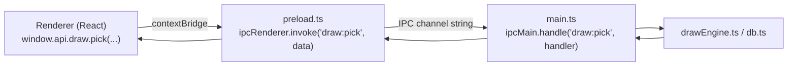

# IPC 3 lớp, mô hình Session/Tab, và đa cửa sổ

## IPC 3 lớp bắt buộc đồng bộ

Đây là quy tắc **quan trọng nhất, dễ vỡ nhất** khi thêm tính năng mới. Mọi khả năng renderer cần main process làm hộ (đọc DB, đọc file, mở URL ngoài...) đều phải xuyên qua đúng 3 lớp, thiếu 1 lớp là lỗi runtime `"... is not a function"` (không phải lỗi TypeScript, vì `window.api` được `as any`-hoá qua `contextBridge`).

3 chỗ phải sửa cùng lúc:
1. `electron/main.ts` — `ipcMain.handle("tên:kênh", (event, ...args) => {...})`, handler thật, đọc/ghi DB ở đây.
2. `electron/preload.ts` — expose 1 hàm gọi `ipcRenderer.invoke("tên:kênh", ...)`, gắn vào object `api` theo đúng namespace (`draw.pick`, `shell.openExternal`...).
3. `src/types.ts` — khai báo lại đúng chữ ký hàm đó trong `declare global { interface Window { api: {...} } }` để renderer có autocomplete + type-check.

Lưu ý runtime: sau khi sửa `electron/*.ts`, **phải tắt bật lại `npm run electron:dev`** — script này chạy `build:electron` (biên dịch `electron/` sang `dist-electron/*.js` bằng `tsc`) đúng 1 lần lúc khởi động, không có watch/hot-reload cho phần main process. Nếu quên, app vẫn chạy nhưng dùng bản `preload.js` CŨ — dẫn đúng tới lỗi `window.api.xxx is not a function` dù code nguồn đã đúng.

## Mô hình Session/Tab

`sessions` là bảng gốc — mọi `participants`/`prizes`/`draw_results` đều có cột `session_id` trỏ về đây. `SessionContext.tsx` (React Context, chỉ dùng ở cửa sổ chính) giữ `activeSessionId`, nhớ lại tab cuối dùng qua `localStorage` để mở đúng tab đó ở lần chạy sau.

**Quy tắc bắt buộc**: bất kỳ IPC handler hay câu SQL mới nào đụng tới `participants`/`prizes` đều phải lọc theo `session_id` — quên bước này từng gây lỗi thật ở `Dashboard.tsx`/`Prizes.tsx` (hiện dữ liệu của TẤT CẢ session thay vì chỉ session đang active).

## Kiến trúc đa cửa sổ (multi-window)

3 loại `BrowserWindow`, cùng dùng chung 1 `preload.js` (nên `window.api` giống hệt nhau ở cả 3):

| Cửa sổ | Route | Đặc điểm |
|---|---|---|
| Cửa sổ chính | `/`, `/participants`, `/prizes`, `/landing`, `/settings` | Có `<Layout>` (sidebar + `TabBar`), theo tab đang active qua `SessionContext` |
| Present Mode | `/present/:sessionId` | Không sidebar, full-screen, `LandingRenderer interactive=true` — nơi khán giả xem |
| Landing Builder | `/landing-builder/:sessionId` | Không sidebar, full-screen, canvas kéo-thả — nơi người tổ chức THIẾT KẾ (không tương tác thật) |

Cả 2 cửa sổ phụ tự fetch session/participants/prizes riêng qua `window.api` (không dùng `SessionContext`, vì đó là 1 cửa sổ độc lập với Context Provider riêng của React — mỗi `BrowserWindow` là 1 renderer process/React tree hoàn toàn tách biệt). Chi tiết cách 2 cửa sổ Landing dùng chung 1 nguồn dữ liệu: [`docs/landing/README.md`](../landing/README.md) mục 1.
