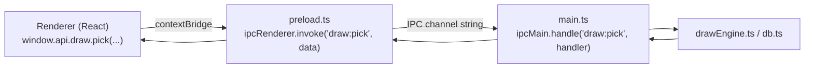

# IPC 3 lớp, mô hình Session/Tab, và đa cửa sổ

## IPC 3 lớp bắt buộc đồng bộ

Đây là quy tắc **quan trọng nhất, dễ vỡ nhất** khi thêm tính năng mới. Mọi khả năng renderer cần main process làm hộ (đọc DB, đọc file, mở URL ngoài...) đều phải xuyên qua đúng 3 lớp, thiếu 1 lớp là lỗi runtime `"... is not a function"` (không phải lỗi TypeScript, vì `window.api` được `as any`-hoá qua `contextBridge`).

3 chỗ phải sửa cùng lúc:
1. `electron/main.ts` — `ipcMain.handle("tên:kênh", (event, ...args) => {...})`, handler thật, đọc/ghi DB ở đây.
2. `electron/preload.ts` — expose 1 hàm gọi `ipcRenderer.invoke("tên:kênh", ...)`, gắn vào object `api` theo đúng namespace (`draw.pick`, `shell.openExternal`...).
3. `src/types.ts` — khai báo lại đúng chữ ký hàm đó trong `declare global { interface Window { api: {...} } }` để renderer có autocomplete + type-check.

Lưu ý runtime: sau khi sửa `electron/*.ts`, **phải tắt bật lại `npm run electron:dev`** — script này chạy `build:electron` (biên dịch `electron/` sang `dist-electron/*.js` bằng `tsc`) đúng 1 lần lúc khởi động, không có watch/hot-reload cho phần main process. Nếu quên, app vẫn chạy nhưng dùng bản `preload.js` CŨ — dẫn đúng tới lỗi `window.api.xxx is not a function` dù code nguồn đã đúng.

## Mô hình Session/Tab

`sessions` là bảng gốc — mọi `participants`/`prizes`/`draw_results` đều có cột `session_id` trỏ về đây. `SessionContext.tsx` (React Context, chỉ dùng ở cửa sổ chính) giữ `activeSessionId`, nhớ lại tab cuối dùng qua `localStorage` để mở đúng tab đó ở lần chạy sau.

**Quy tắc bắt buộc**: bất kỳ IPC handler hay câu SQL mới nào đụng tới `participants`/`prizes` đều phải lọc theo `session_id` — quên bước này từng gây lỗi thật ở `Dashboard.tsx`/`Prizes.tsx` (hiện dữ liệu của TẤT CẢ session thay vì chỉ session đang active).

## Kiến trúc đa cửa sổ (multi-window)

4 loại `BrowserWindow`, cùng dùng chung 1 `preload.js` (nên `window.api` giống hệt nhau ở cả 4):

| Cửa sổ | Route | Đặc điểm |
|---|---|---|
| Cửa sổ chính | `/`, `/participants`, `/prizes`, `/landing`, `/settings` | Có `<Layout>` (sidebar + `TabBar`), theo tab đang active qua `SessionContext` |
| Present Mode | `/present/:sessionId` | Không sidebar, không menu bar (`removeMenu()`), mở WINDOWED — `LandingRenderer interactive=true`, nơi khán giả xem |
| Landing Builder | `/landing-builder/:sessionId` | Không sidebar, còn menu bar mặc định, windowed 1440×900, canvas kéo-thả — nơi người tổ chức THIẾT KẾ (không tương tác thật) |
| Data Editor | `/data-editor/:sessionId` | Không sidebar, còn menu bar mặc định, windowed 1440×900 — `DataEditorModal.tsx` (Edit participant) render full-window thay vì modal trong cửa sổ chính như trước |

3 cửa sổ phụ đều tự fetch session/participants/prizes riêng qua `window.api` (không dùng
`SessionContext`, vì đó là 1 cửa sổ độc lập với Context Provider riêng của React — mỗi `BrowserWindow`
là 1 renderer process/React tree hoàn toàn tách biệt). `DataEditorModal.tsx` từng tự gọi `useSession()`
bên trong (lúc còn sống trong cửa sổ chính, cùng cây `SessionProvider`) — đổi sang nhận `session` +
`onSessionRefresh` qua props khi tách thành cửa sổ riêng, xem `DataEditorWindow.tsx`. Chi tiết cách 2
cửa sổ Landing dùng chung 1 nguồn dữ liệu: [`docs/landing/README.md`](../landing/README.md) mục 1.

Cả 3 cửa sổ phụ (Present/Builder/Editor) là **singleton THEO TỪNG SESSION** (`Map<sessionId,
BrowserWindow>` module-level cho mỗi loại trong `main.ts`, KHÔNG phải 1 biến DUY NHẤT cho toàn app
như trước) — mở cho session B trong lúc Builder của session A đang mở sẽ ra 1 cửa sổ Builder MỚI cho
B, không đụng gì tới cửa sổ A; mở lại ĐÚNG session đang có cửa sổ chỉ `focus()` lại, không tạo trùng.
Trạng thái "chưa lưu" (Builder/Editor) cũng theo TỪNG cửa sổ — `Map<BrowserWindow, boolean>`, cập nhật
qua `BrowserWindow.fromWebContents(e.sender)` khi nhận IPC `landingBuilder:dirty-changed`/
`editor:dirty-changed` (nhiều cửa sổ CÙNG LOẠI gửi chung 1 channel này, phải tách theo đúng cửa sổ nào
vừa gửi, không thể suy chỉ từ payload).

### Tiêu đề cửa sổ — role + tên session (`getWindowTitle`, `appConfig.ts`)

`getWindowTitle(role?, sessionName?)` sinh tiêu đề, dùng ở CẢ 4 cửa sổ:
- Cửa sổ chính: gọi KHÔNG tham số → `"[dev] Lucky Draw Studio"` (hoặc không tiền tố ở production).
- 3 cửa sổ phụ: gọi kèm `role` ("Builder"/"Editor"/"Presentation") + tên session thật (đọc trực tiếp
  qua `db.prepare("SELECT name FROM sessions WHERE id = ?")` trong `openXxxWindow`, đồng bộ, đủ nhanh
  cho 1 câu SELECT 1 dòng) → vd `"[dev] Lucky Draw Builder for Test Session"`. `role` THAY HẲN "Studio"
  (không nối thêm đằng sau) — mục đích phân biệt NHIỀU cửa sổ trên taskbar/Alt-Tab khi có nhiều tab
  đang mở nhiều cửa sổ phụ cùng lúc.

Mọi `BrowserWindow` (kể cả cửa sổ chính) đều `.on("page-title-updated", (e) => e.preventDefault())` —
`index.html` có `<title>` TĨNH ("Lucky Draw Studio"), thiếu bước khoá này thì Chromium tự ghi đè lại
tiêu đề đã set bằng đúng chữ tĩnh đó ngay khi trang load xong.

### Present Mode: mở windowed, tự bấm fullscreen (không dùng Esc)

`openPresentWindow` (`electron/main.ts`) mở cửa sổ Present ở kích thước cửa sổ thường (1280×720, `removeMenu()` để ẩn File/Edit/View/Window/Help) — CỐ Ý không tự fullscreen ngay, để người vận hành kéo cửa sổ sang màn hình 2 (nếu trình chiếu 2 màn) trước khi vào fullscreen; tự fullscreen ngay từ đầu thì luôn dính màn hình chính, phải thoát ra mới kéo được.

Vào/thoát fullscreen thật (`BrowserWindow.setFullScreen`) qua 2 đường, cả 2 đều dùng chung 1 state (`isFullscreen`, đồng bộ qua sự kiện `enter-full-screen`/`leave-full-screen` main → renderer):
- Phím **F11** — bắt bằng `webContents.on("before-input-event", ...)` ở main process (không dựa vào accelerator của menu mặc định, vì `removeMenu()` đã gỡ nó, và để hành vi giống nhau trên Windows lẫn macOS).
- Nút overlay góc trên-phải trong `PresentMode.tsx` (mờ, sáng khi hover) — gọi IPC `present:toggleFullscreen`.

**CỐ Ý không dùng Esc để thoát fullscreen** — cửa sổ này dùng Esc dày đặc cho việc khác (`EscapeKeyHandler` trong `LandingRenderer.tsx`: ẩn Scoreboard, huỷ popup Confirm/Draw Mode/Info...). `before-input-event` không gọi `preventDefault()` nên phím vẫn lọt xuống renderer — nếu Esc cũng thoát fullscreen ở main process thì 1 lần bấm Esc lúc đang mở popup sẽ vừa đóng popup vừa thoát fullscreen cùng lúc, gây khó hiểu. Đã cân nhắc và bỏ hẳn Esc vì lý do này (xem thêm [`docs/landing/present-mode.md`](../landing/present-mode.md)).

Toggle fullscreen không đụng gì tới `useDrawSequence.ts` (Draw/Confirm/`spinning`...) — chỉ đổi kích thước hiển thị của cửa sổ, nên bấm được bất cứ lúc nào, kể cả đang quay số, không cần khoá gì thêm.
