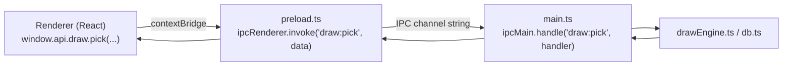
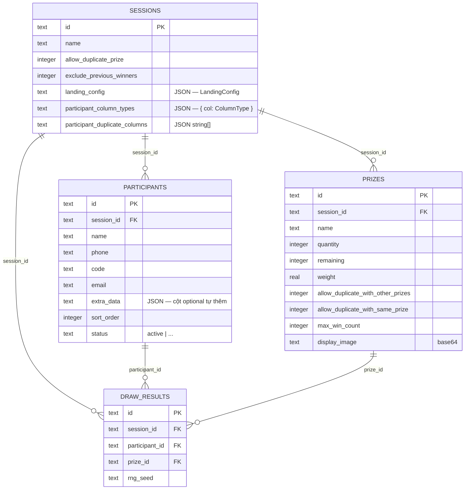
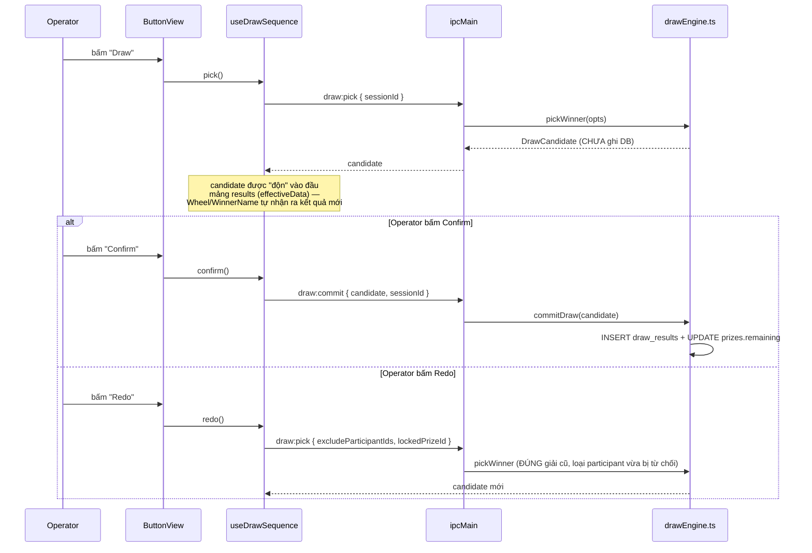
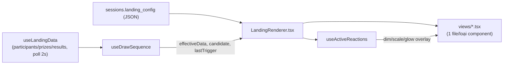

# Lucky Draw Studio — Developer Guide

## 1. Mục tiêu & ý tưởng sản phẩm

Lucky Draw Studio là app **desktop offline hoàn toàn** dùng để quay số trúng thưởng cho sự kiện (hội chợ, minigame Facebook, sự kiện nội bộ công ty...). Không có backend, không có cloud, không cần Internet lúc vận hành — mọi dữ liệu (participants, prizes, kết quả quay) nằm trong 1 file SQLite cục bộ trên máy người tổ chức.

Ý tưởng kiến trúc cốt lõi, xuất phát từ chính nhu cầu vận hành thực tế:

- **1 "phiên quay số" = 1 tab kiểu Chrome**, độc lập hoàn toàn về participants/prizes với các phiên khác. Lý do: 1 người tổ chức sự kiện thường chạy nhiều minigame/đợt quay khác nhau trong cùng 1 ngày (vd sáng quay khách hàng cũ, chiều quay khách hàng mới), không muốn dữ liệu 2 đợt lẫn vào nhau, và không muốn phải mở nhiều lần app.
- **Draw Engine tách biệt hoàn toàn khỏi Presentation Layer**. Việc "chọn ai trúng" (thuật toán random có trọng số, loại trừ theo luật) và việc "hiển thị lên màn hình cho khán giả xem" là 2 việc độc lập — Draw Engine không biết gì về UI, UI (Landing Page) chỉ đọc kết quả Draw Engine trả về, không bao giờ tự tính toán ai trúng.
- **Landing Page Builder kiểu "trình chiếu tuỳ biến"**: người tổ chức tự thiết kế màn hình trình chiếu (kéo-thả component, chỉnh màu/font/hiệu ứng) thay vì dùng 1 giao diện quay số cố định — vì mỗi sự kiện có branding/không khí khác nhau.
- **Data Editor như 1 trình soạn thảo bảng tính rút gọn** (giống Excel/Google Sheets thu nhỏ) ngay trong app, để người tổ chức không phải rời khỏi app để dọn dữ liệu participant trước khi quay.

## 2. Tech Stack

| Layer | Công nghệ | Vì sao chọn |
|---|---|---|
| Desktop shell | Electron | Duy nhất cho phép build app offline chạy Windows/macOS từ 1 codebase web, có `fs`/`shell` native |
| UI | React 18 + TypeScript | Component model phù hợp Builder kiểu kéo-thả, TS bắt lỗi sớm cho 1 codebase nhiều kiểu dữ liệu (Participant/Prize/LandingComponent...) |
| Build/dev server | Vite | Hot-reload nhanh cho renderer, tách biệt rõ với build electron (`tsc -p electron/tsconfig.json`) |
| Styling | Tailwind CSS | Không cần thêm build step riêng cho CSS, style inline ngay cạnh JSX — hợp với tốc độ lặp UI nhanh của 1 app 1 người maintain |
| DB | better-sqlite3 | Đồng bộ (synchronous API) — tránh phải quản lý async/await cho MỌI query trong 1 app vốn đã nhiều IPC async rồi; là **native module** nên bắt buộc `electron-rebuild` mỗi khi đổi Electron version hay `npm install` lại |
| Router | react-router-dom | Điều hướng giữa các trang trong cửa sổ chính + định tuyến cho 2 loại cửa sổ phụ (`/present/:sessionId`, `/landing-builder/:sessionId`) |
| Import dữ liệu | papaparse (CSV), xlsx (Excel) | Import participant từ file người tổ chức đã có sẵn |

## 3. Cấu trúc thư mục

```
electron/
  main.ts            # Main process — tạo BrowserWindow, đăng ký MỌI ipcMain.handle
  preload.ts          # contextBridge — "cửa" duy nhất renderer được phép gọi ra main process
  db.ts               # Kết nối SQLite + TOÀN BỘ migration (chạy tuần tự mỗi lần app khởi động)
  drawEngine.ts       # Thuật toán chọn người trúng (pickWinner/commitDraw/drawOne)

src/
  types.ts            # Participant/Prize/Session/DrawResultRow + khai báo type window.api
  context/SessionContext.tsx   # State "tab nào đang active" cho cửa sổ chính
  pages/              # 1 file = 1 route (Dashboard, Participants, Prizes, LandingPage...)
  components/
    DataEditorModal.tsx         # Component chính của Data Editor (rất lớn, xem mục 5)
    landing/
      componentRegistry.ts      # Nơi DUY NHẤT "nối dây" 1 loại component Landing vào Palette + Canvas
      LandingCanvas.tsx          # Bề mặt kéo-thả trong Builder (select/hand tool, zoom, resize, snap)
      LandingRenderer.tsx        # Painter thuần — dùng chung bởi Builder preview VÀ Present Mode
      LandingRulers.tsx          # Thước ngang/dọc kiểu Photoshop
      PropertiesPanel.tsx        # Panel bên phải Builder — switch theo type để render đúng form con
      useLandingData.ts          # Nguồn fetch/poll DUY NHẤT cho participants/prizes/kết quả quay
      useDrawSequence.ts          # Hook luồng Draw/Confirm/Redo (candidate đang chờ, chưa commit)
      useActiveReactions.ts       # Tính reaction (dim/scale/glow) nào đang active tại 1 thời điểm
      views/*.tsx                 # 1 file = cách VẼ 1 loại component (chỉ đọc props + data)
      panels/*.tsx                 # 1 file = form cấu hình của đúng loại component đó
      luckyWheelTemplates/*.tsx     # 2 "cách quay" của component luckyWheel (Wheel/Digit Roller)
  lib/
    landing/types.ts    # Kiểu dữ liệu trung tâm của Landing Page (LandingComponent union, v.v.)
    dataEditor/          # Kiểu dữ liệu + logic thuần (không JSX) của Data Editor — xem mục 5
      types.ts, commands.ts, validate.ts, transforms.ts, history.ts
```

## 4. Kiến trúc lõi

### 4.1. IPC 3 lớp bắt buộc đồng bộ

Đây là quy tắc **quan trọng nhất, dễ vỡ nhất** khi thêm tính năng mới. Mọi khả năng renderer cần main process làm hộ (đọc DB, đọc file, mở URL ngoài...) đều phải xuyên qua đúng 3 lớp, thiếu 1 lớp là lỗi runtime `"... is not a function"` (không phải lỗi TypeScript, vì `window.api` được `as any`-hoá qua `contextBridge`).



3 chỗ phải sửa cùng lúc:
1. `electron/main.ts` — `ipcMain.handle("tên:kênh", (event, ...args) => {...})`, handler thật, đọc/ghi DB ở đây.
2. `electron/preload.ts` — expose 1 hàm gọi `ipcRenderer.invoke("tên:kênh", ...)`, gắn vào object `api` theo đúng namespace (`draw.pick`, `shell.openExternal`...).
3. `src/types.ts` — khai báo lại đúng chữ ký hàm đó trong `declare global { interface Window { api: {...} } }` để renderer có autocomplete + type-check.

Lưu ý runtime: sau khi sửa `electron/*.ts`, **phải tắt bật lại `npm run electron:dev`** — script này chạy `build:electron` (biên dịch `electron/` sang `dist-electron/*.js` bằng `tsc`) đúng 1 lần lúc khởi động, không có watch/hot-reload cho phần main process. Nếu quên, app vẫn chạy nhưng dùng bản `preload.js` CŨ — dẫn đúng tới lỗi `window.api.xxx is not a function` dù code nguồn đã đúng.

### 4.2. Mô hình Session/Tab

`sessions` là bảng gốc — mọi `participants`/`prizes`/`draw_results` đều có cột `session_id` trỏ về đây. `SessionContext.tsx` (React Context, chỉ dùng ở cửa sổ chính) giữ `activeSessionId`, nhớ lại tab cuối dùng qua `localStorage` để mở đúng tab đó ở lần chạy sau.

**Quy tắc bắt buộc**: bất kỳ IPC handler hay câu SQL mới nào đụng tới `participants`/`prizes` đều phải lọc theo `session_id` — quên bước này từng gây lỗi thật ở `Dashboard.tsx`/`Prizes.tsx` (hiện dữ liệu của TẤT CẢ session thay vì chỉ session đang active).

### 4.3. SQLite schema + chiến lược migration



`electron/db.ts` là nơi DUY NHẤT chứa schema + migration. Pattern lặp lại cho MỌI migration trong file này (xem `migrateSessionColumnTypes`, `migrateParticipantSortOrder`...):

```ts
function migrateXxx() {
  const cols = (db.prepare(`PRAGMA table_info(<table>)`).all() as { name: string }[]).map((c) => c.name);
  if (!cols.includes("<cột mới>")) {
    db.exec(`ALTER TABLE <table> ADD COLUMN <cột mới> <type>`);
  }
}
migrateXxx(); // gọi ngay dưới định nghĩa, chạy mỗi lần app khởi động
```

An toàn khi chạy lại nhiều lần (idempotent — luôn kiểm tra cột đã tồn tại chưa trước khi `ALTER`), không bao giờ `DROP`/mất dữ liệu cũ. Khi cần đổi CẤU TRÚC bảng (không chỉ thêm cột — vd bỏ ràng buộc `UNIQUE` toàn cục), pattern là: tạo bảng `_new`, `INSERT ... SELECT` copy dữ liệu cũ sang, `DROP` bảng cũ, `RENAME` bảng mới về tên cũ (xem `migrateToPerSessionData`, đổi từ participants toàn app dùng chung sang participants theo từng session).

**Trước khi sửa `db.ts`**: luôn hỏi lại người dùng nếu thay đổi liên quan tới schema — không được viết migration phá dữ liệu người dùng đã có.

### 4.4. Kiến trúc đa cửa sổ (multi-window)

3 loại `BrowserWindow`, cùng dùng chung 1 `preload.js` (nên `window.api` giống hệt nhau ở cả 3):

| Cửa sổ | Route | Đặc điểm |
|---|---|---|
| Cửa sổ chính | `/`, `/participants`, `/prizes`, `/landing`, `/settings` | Có `<Layout>` (sidebar + `TabBar`), theo tab đang active qua `SessionContext` |
| Present Mode | `/present/:sessionId` | Không sidebar, full-screen, `LandingRenderer interactive=true` — nơi khán giả xem |
| Landing Builder | `/landing-builder/:sessionId` | Không sidebar, full-screen, canvas kéo-thả — nơi người tổ chức THIẾT KẾ (không tương tác thật) |

Cả 2 cửa sổ phụ tự fetch session/participants/prizes riêng qua `window.api` (không dùng `SessionContext`, vì đó là 1 cửa sổ độc lập với Context Provider riêng của React — mỗi `BrowserWindow` là 1 renderer process/React tree hoàn toàn tách biệt).

## 5. Tính năng: Data Editor

### 5.1. Ý tưởng ban đầu

Cho phép người tổ chức sửa dữ liệu participant (đã import từ CSV/Excel hoặc nhập tay) ngay trong app, với trải nghiệm gần giống 1 bảng tính: sửa từng ô, xoá/thêm hàng-cột, tìm & thay thế, phát hiện trùng lặp, sinh mã tự động — **có Undo/Redo cho MỌI thao tác, kể cả thao tác hàng loạt**.

### 5.2. Command Pattern — trục xương sống

File: `src/lib/dataEditor/commands.ts` + `history.ts`. Mọi thao tác sửa dữ liệu (sửa 1 ô, Clean, Generate, xoá dòng, paste 1 khối ô...) đều được model hoá thành 1 `Command`:

```ts
interface Command {
  label: string;                                  // hiện trong panel History, vd "Generate ID → code (478 rows)"
  execute: (state: EditorState) => EditorState;    // pure function, KHÔNG side-effect
  undo: (state: EditorState) => EditorState;
}
```

`useCommandHistory` (trong `history.ts`) giữ `pastRef`/`futureRef` (2 mảng `Command[]`) thay vì state React trực tiếp — nhờ vậy `jumpTo(targetLength)` (bấm 1 dòng bất kỳ trong panel History để rollback thẳng tới đó) chỉ cần chạy 1 vòng lặp `undo`/`execute` liên tiếp trên biến cục bộ, không đợi React re-render giữa các bước.

**Thêm 1 thao tác Data Editor mới**: viết 1 hàm `xxxCommand(state, ...) => Command` trong `commands.ts`, gọi qua `history.run(xxxCommand(...))` trong `DataEditorModal.tsx`. KHÔNG sửa trực tiếp state trong component — phá vỡ Undo/Redo.

Helper dùng lại nhiều nhất: `setColumnValuesCommand(state, label, col, valueFor)` — nhận 1 hàm `(row, index) => giá trị mới`, tự lo việc tạo cột nếu chưa tồn tại + tự lo undo (backup giá trị cũ trước khi ghi). `generateIdCommand`, `runningNumberCommand`, `displayPhoneCommand` đều build trên helper này.

### 5.3. Hệ thống Column Type

`ColumnType = "text" | "name" | "phone" | "email" | "code" | "url"`, lưu ở `sessions.participant_column_types` (JSON `{ [tênCột]: ColumnType }`). Áp dụng cho **MỌI cột** — kể cả 4 field cố định (`name`/`phone`/`code`/`email`) lẫn cột optional tự thêm (lưu trong `participants.extra_data`) — không phân biệt "cột cố định" vs "cột optional" nữa (quyết định thiết kế: đơn giản hoá, tất cả các cột đều như nhau).

`validateState()` (`validate.ts`) chạy lại mỗi khi state/columnTypes đổi, trả về `CellIssue[]` — quét theo type đã gán cho từng cột (phone → `isValidVietnamesePhone`, email → regex, url → `isValidUrl`, name → so khớp "kiểu viết hoa phổ biến nhất" thay vì ép Title Case cứng). Trùng lặp (`findDuplicateIssues`) là 1 khái niệm TÁCH RIÊNG khỏi type — dựa vào `participant_duplicate_columns` (compound key, chọn 1 hay nhiều cột).

### 5.4. Sinh mã tự động (Generate → Sequential)

`generateIdCommand` (đã sửa gần đây): độ rộng số **tự tính theo số dòng hiện có**, không cố định 4 chữ số:

```ts
export function sequentialIdDigitWidth(rowCount: number): number {
  return String(Math.max(1, rowCount)).length; // 478 dòng -> 3 chữ số (001-478)
}
```

## 6. Tính năng: Draw Engine

File `electron/drawEngine.ts` — phần **nhạy cảm nhất về tính công bằng**, không tự ý đổi thuật toán nếu không được yêu cầu rõ.

Tách làm 3 hàm, tách để phục vụ luồng Button Draw/Confirm/Redo trên Landing Page (xem mục 9) mà KHÔNG đổi hành vi của nút "Draw now" cũ (trang Draw):

```ts
pickWinner(opts): DrawCandidate   // CHỌN, KHÔNG ghi DB
commitDraw(candidate, sessionId)   // ghi DB thật (INSERT draw_results + UPDATE prizes.remaining)
drawOne(opts) { return commitDraw(pickWinner(opts), opts.sessionId); }  // hành vi CŨ, không đổi
```

Thuật toán `pickWinner`, theo đúng thứ tự:

1. Lọc `prizes` còn `remaining > 0` và `status = 'active'` (lọc theo `lockedPrizeId` nếu có — ca Redo).
2. Lọc `participants` `status = 'active'`, trừ người đã trúng (nếu session bật `exclude_previous_winners`), trừ `excludeParticipantIds` (ca Redo).
3. **Random có trọng số** để chọn 1 giải trong các giải còn hợp lệ (`weight` càng cao càng dễ trúng) — nếu giải đó KHÔNG còn ai đủ điều kiện (do luật trùng lặp cấp giải), loại giải đó và roll lại trong phần còn lại (tránh "chọn trúng giải nhưng không ai nhận được").
4. Random đều (`randomInt`) 1 người trong nhóm đủ điều kiện của giải đã chọn.

Luật trùng lặp cấp giải (`eligibleParticipantsForPrize`): `allow_duplicate_with_same_prize` + `max_win_count` (1 người trúng ĐÚNG giải này tối đa bao nhiêu lần), `allow_duplicate_with_other_prizes` (đã trúng giải KHÁC thì có được trúng tiếp giải này không).

## 7. Tính năng: Landing Page Builder

### 7.1. Kiến trúc dữ liệu

Toàn bộ layout 1 trang trình chiếu là **1 object `LandingConfig` duy nhất**, lưu nguyên JSON trong `sessions.landing_config`. Builder chỉ SỬA object này; Present Mode chỉ ĐỌC/RENDER object này — không có state nào khác ở giữa.

`LandingComponent` (`src/lib/landing/types.ts`) là 1 **discriminated union** theo `type`:

```ts
type LandingComponent =
  | TextComponent | ImageComponent | LuckyWheelComponent | WinnerNameComponent
  | PrizeNameComponent | PrizeImageComponent
  | CurrentTimeComponent | ParticipantCountComponent | ButtonComponent;
```

Mỗi variant = `BaseComponent` (x/y/width/height/zIndex/effect/reactions) + `props` riêng theo type. **Checklist thêm 1 loại component mới** (viết sẵn thành comment ở đầu file `types.ts`), đúng 4 bước, không cần sửa chỗ nào khác:

1. Thêm interface `XxxProps` + variant `XxxComponent` vào union `LandingComponent`.
2. Thêm `src/components/landing/views/XxxView.tsx` — chỉ render, nhận `props` + `LandingData`.
3. Thêm `src/components/landing/panels/XxxPanel.tsx` — form cấu hình trong Properties Panel.
4. Đăng ký trong `componentRegistry.ts` — chỗ DUY NHẤT "nối dây" loại mới vào Palette (kéo-thả) + Canvas (tạo instance mặc định khi thả).

### 7.2. Component Registry pattern

```ts
COMPONENT_REGISTRY: Record<LandingComponentType, {
  label, description, defaultWidth, defaultHeight,
  createDefaultProps: () => LandingComponent["props"],
}>
```

`createComponentAt(type, x, y, zIndex)` đọc registry, tạo 1 instance mới ngay tại vị trí thả chuột. `ComponentPalette.tsx` chỉ là 1 vòng `map` qua `COMPONENT_TYPES` — không có logic riêng cho từng loại.

### 7.3. LandingCanvas — bề mặt kéo-thả trong Builder

Vẽ nền bằng CHÍNH `LandingRenderer` (đảm bảo Builder preview và Present Mode không bao giờ lệch pixel), phủ lên 1 overlay cùng scale để xử lý:

- **Select/Hand tool** (phím tắt `V`/`H`): Hand tool bị disable khi đang ở mức zoom "vừa khung" (không còn gì để pan).
- **Zoom** (`Ctrl/Cmd +/-`): `scale = fitScale * zoom`, `zoom = 1` là mốc zoom-out tối đa.
- **Pan bị kẹp (`clampPan`)**: không cho kéo lộ khoảng trống ở rìa hay trôi mất landing — biên độ pan tính từ chênh lệch `artboard - vùng nhìn`.
- **Center snap guide** kiểu Photoshop: khi kéo di chuyển 1 component, nếu tâm nó cách tâm canvas dưới `CENTER_SNAP_PX` (tính theo px MÀN HÌNH, chia cho `scale` để không đổi cảm giác theo mức zoom) thì tự bắt dính + hiện gạch đỏ.

Toán kéo-thả (di chuyển/resize) đều theo pattern: `mousedown` lưu điểm bắt đầu → gắn `mousemove`/`mouseup` vào `window` (không phải vào element) → tính delta rồi chia cho `scale` để ra đúng đơn vị artboard.

### 7.4. Properties Panel pattern

`PropertiesPanel.tsx` không có gì được chọn → render `BackgroundPanel`; có chọn → render `SharedFields` (x/y/w/h/effect + xoá + `ReactionsEditor`) + đúng 1 panel con theo `selected.type` (switch). Panel con nhận `props` (bag) + `onChange(patch: Partial<Props>)` — không tự quản lý state, mọi thay đổi đẩy ngược lên `LandingBuilderWindow` để ghi vào `LandingConfig`.

### 7.5. useLandingData — nguồn dữ liệu sống duy nhất

Poll `participants`/`prizes`/`draw_results` mỗi 2s qua `window.api`, dùng chung bởi Present Mode VÀ Builder preview — không component nào tự fetch riêng, tránh lệch dữ liệu giữa các phần của cùng 1 màn hình.

## 8. Tính năng: Lucky Wheel (2 template)

`LuckyWheelView.tsx` là dispatcher theo `props.template`, mỗi template tự quản lý animation riêng (cơ chế quay khác hẳn nhau nên không gộp logic), chỉ dùng chung phần binding dữ liệu.

### 8.1. Template "wheel" (Wheel Circular)

`WheelTemplate.tsx` — vòng tròn chia segment theo từng participant (khử trùng theo `drawField`), quay bằng CSS `transform: rotate()` + `transition`, dừng đúng góc ứng với người trúng thật (đọc từ `data.results[0]`, KHÔNG tự chọn người trúng).

### 8.2. Template "digitRoller" (Digit Roller)

`DigitRollerTemplate.tsx` — hiện N ô ký tự kiểu máy đánh số/slot-machine, nhấp nháy ngẫu nhiên rồi dừng ở giá trị thật.

**Định nghĩa quan trọng, đã đổi 1 lần trong quá trình phát triển — lưu ý khi đọc/sửa code này**:

> Digit Roll = quy ước về **số lượng ô ký tự (character slots)** hiển thị trên màn hình, KHÔNG phải kiểm tra dữ liệu có phải toàn số hay không.

Ban đầu code strip ký tự không phải số (`.replace(/\D/g, "")`) rồi mới đếm — nghĩa là `"ENFA0001"` bị coi là field "4-digit" (chỉ tính phần `"0001"`). Sau khi xác nhận lại với người yêu cầu, đổi thành: giá trị RAW (kể cả prefix chữ) phải dài ĐÚNG BẰNG `digitCount`, không cắt/lọc gì cả. `"ENFA0001"` (8 ký tự) hợp lệ cho 1 Digit Roll 8 ô, y hệt `"12345678"`.

Hệ quả: `DigitRollerTemplate` không còn `.replace(/\D/g, "")` — hiển thị **nguyên vẹn** giá trị thật; animation nhấp nháy lúc quay cũng đổi từ random digit (0-9) sang random ký tự chữ+số (`FLICKER_CHARS`), để không bị "lệch tông" khi giá trị thật có chữ cái.

Kích thước ô luôn tính từ khung kéo-thả trên canvas (`component.width`/`height`), không lệ thuộc 1 field "Font size" tách rời — giống hệt cách `WheelTemplate` lấy `size = min(width, height)`. Đây cũng là 1 quyết định sửa lại: ban đầu ô tính từ `fontSize` cố định, khiến khung mặc định (kế thừa 500×500 từ Wheel Circular) to hơn hẳn nội dung thật.

### 8.3. Field validation trong LuckyWheelPanel — "field nào dùng được cho Digit Roll"

`evaluateField(field, count)` trong `LuckyWheelPanel.tsx` — field hợp lệ khi VÀ CHỈ KHI **100% participant** có giá trị dài đúng bằng `count`. Sinh ra tối đa 3 lý do độc lập (không loại trừ nhau, có thể cùng xảy ra), hiện qua `title` (tooltip HTML, hỗ trợ xuống dòng bằng `\n`) trên `<option disabled>`:

- Thiếu dữ liệu (`N participants have no value...`)
- Độ dài không đồng nhất giữa các participant (`Length is inconsistent...`)
- Độ dài không khớp `digitCount` đang chọn (`Values have X characters — need exactly N`)

Danh sách field để chọn KHÔNG giới hạn 4 field cố định (Name/Phone/Email/Code) — hợp nhất thêm mọi cột optional (`extra_data`) đang thực sự xuất hiện ở participant (`extraColumns`, gom qua `JSON.parse(p.extra_data)`), qua đúng `getParticipantField()` đã được mở rộng để tự fallback sang `getParticipantExtraField()` khi field không khớp 5 tên cố định.

## 9. Tính năng: Interactive Buttons + Trigger/Effect Reactions

### 9.1. Ý tưởng

Cho phép người tổ chức đặt các nút bấm THẬT lên Landing Page (Quay số / Xác nhận / Quay lại / Mở liên kết), điều khiển được toàn bộ chuỗi quay ngay trên màn hình trình chiếu — thay vì phải quay ở cửa sổ chính rồi mới thấy hiện lên. Đi kèm là hệ effect "hiệu ứng phản ứng theo hành động" (nền tối đi khi bấm Quay, ảnh giải thưởng phóng to + phát sáng khi Xác nhận...).

### 9.2. useDrawSequence — luồng Draw/Confirm/Redo

`ButtonAction = "draw" | "confirm" | "redo" | "openLink"`. Chỉ hoạt động thật khi `interactive=true` (Present Mode) — trong Builder canvas Button luôn hiện `disabled` (không mờ đi, chỉ đơn thuần không bấm được — xem mục 9.4) để tránh bấm nhầm chạy quay thật lúc đang thiết kế.



Điểm hay: `effectiveData` (trong `useDrawSequence.ts`) "độn" candidate đang chờ vào ĐẦU mảng `results` dưới dạng 1 `DrawResultRow` giả (`id: "pending-<seed>"`) — nhờ vậy MỌI view đã có sẵn (`WheelTemplate`, `DigitRollerTemplate`, `WinnerNameView`, `PrizeImageView`...) tự nhận ra "có kết quả mới" qua đúng cơ chế `results[0]?.id` đang dùng, **không cần sửa gì ở các file view đó** khi thêm tính năng Button.

### 9.3. EffectReaction — hệ effect generic

```ts
interface EffectReaction {
  trigger: "draw" | "confirm" | "redo";
  delayMs: number;    // chờ bao lâu sau trigger mới áp
  durationMs: number; // giữ bao lâu rồi tự trả về bình thường; 0 = giữ tới trigger kế tiếp
  dim?: number; scale?: number; glow?: boolean; glowColor?: string;
}
```

BẤT KỲ component nào (và cả canvas background) đều có thể mang mảng `reactions?: EffectReaction[]` — thêm hiệu ứng cho 1 component chỉ là thêm 1 phần tử vào mảng qua `ReactionsEditor.tsx` (dùng chung, không cần code riêng cho từng cặp component/trigger). `useActiveReactions` tính "target nào đang active reaction gì" tại 1 thời điểm dựa vào `lastTrigger.firedAt` — không poll liên tục, chỉ tự re-render đúng vào mốc bắt đầu/kết thúc qua `setTimeout`.

### 9.4. Bug đã sửa: "Button nhìn trong suốt" trong Builder

`ButtonView.tsx` ban đầu dùng `disabled:opacity-40` — vì `disabled` LUÔN true trong Builder (không có `sequence`), Button luôn hiện mờ 40%, trông như trong suốt. Sửa bằng cách TÁCH 2 khái niệm: "không bấm được vì đang ở Builder" (vẫn hiện FULL độ đậm) khác với "tạm thời không bấm được ở Present Mode thật vì sai phase/busy" (mới thật sự làm mờ) — qua 1 cờ riêng `showFaded = !!sequence && disabled`, không gắn opacity trực tiếp vào thuộc tính HTML `disabled`.

### 9.5. Action "openLink"

Đọc URL từ 1 cột optional (`extra_data`) đã gán Loại dữ liệu "url" ở Data Editor, của CHÍNH participant vừa trúng (`sequence.candidate`) — qua `getParticipantExtraField()`. Mở bằng `shell.openExternal()` (main process, chỉ chấp nhận `http(s)://` để tránh mở nhầm scheme lạ) — KHÔNG dùng `window.open` (bị chặn dưới `contextIsolation: true`).

## 10. Present Mode — pipeline render



`LandingRenderer` là **painter thuần** — không state, không tương tác — dùng lại y nguyên bởi `LandingCanvas` (Builder, `interactive` mặc định `false`) và `PresentMode.tsx` (`interactive=true`), đảm bảo 2 nơi không bao giờ vẽ lệch nhau.

## 11. Coding conventions & những chỗ dễ vỡ (checklist trước khi sửa)

- **`session_id`**: mọi bảng/query participant/prize mới đều phải lọc theo session đang active.
- **IPC 3 lớp**: `main.ts` → `preload.ts` → `types.ts`, thiếu 1 lớp lỗi runtime; sửa `electron/*` phải khởi động lại `electron:dev`.
- **Renderer không tự đọc file** (`fetch("file://...")` bị chặn do `contextIsolation`) — mọi đọc file phải qua IPC (`dialog:openAndReadFile` làm mẫu).
- **Prize/Participant có 2 tầng field**: field cố định (cột DB thật) và field optional (`extra_data`, JSON). `drawEngine.ts` CHỈ đọc field cố định, không bao giờ đọc `extra_data` — giữ ranh giới này (Draw Engine chỉ quan tâm participant là ai để ghi kết quả, không quan tâm nội dung hiển thị).
- **Migration DB**: luôn kiểm tra cột tồn tại trước khi `ALTER`, không `DROP` dữ liệu cũ, hỏi lại người dùng trước khi đổi schema.
- **Màu Tailwind** (`tailwind.config.js`): tên biến giữ nguyên từ bản theme tối cũ, KHÔNG theo nghĩa đen — `gold` = xanh đậm `#2244A5`, `teal` = xanh nhạt `#20C7F1`, `highlight` = vàng `#FFCA2D`.
- **UI luôn tiếng Anh** (đã pivot toàn bộ, quyết định để giữ đơn giản, không xây i18n) — comment code vẫn tiếng Việt.
- **Draw Engine không tự ý đổi thuật toán** nếu không được yêu cầu rõ — đây là phần nhạy cảm nhất về tính công bằng của sản phẩm.

## 12. Hướng mở rộng tiếp theo (đã đề cập nhưng chưa làm)

- Nhiều template Lucky Wheel hơn (`LuckyWheelTemplate` union hiện có `"wheel" | "digitRoller"`, kiến trúc đã sẵn sàng để thêm không đụng code cũ).
- Chuỗi trigger nhiều bước (trigger A tự bắn trigger B) — hiện `EffectReaction` chỉ phản ứng trực tiếp theo 1 trong 3 action Button, chưa hỗ trợ trigger nối trigger.
- Thêm nhiều "knob" hiệu ứng ngoài dim/scale/glow (theo đúng tinh thần "bộ knob cố định nhỏ" đang áp dụng, không phải editor keyframe tự do).
