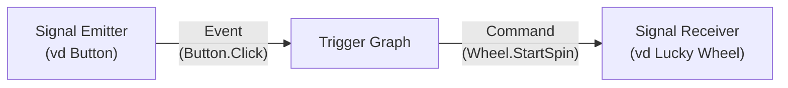
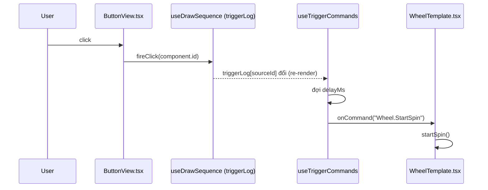

# GRAPH

Tài liệu này giải thích cách màn hình **Trigger Graph** trong Landing Builder hoạt động: ý nghĩa
các node/chấm màu trên sơ đồ, cách 1 "trigger" (link) thực sự chạy lúc Present Mode, và cách nối
dây 1 ví dụ hoàn chỉnh. Đọc file này trước khi sửa bất kỳ gì trong
`src/components/landing/triggerGraph/`.

## 1. SIGNAL EMITTER/SIGNAL RECEIVER

Mọi component trên Landing chỉ thuộc một trong hai nhóm và không bao giờ cả hai (xem thêm
CLAUDE.md, mục "Kiến trúc quan trọng"):

| | Signal Emitter | Signal Receiver |
|---|---|---|
| Presenter trong Present Mode? | Có (click, quét QR...) | Không |
| Việc nó làm | CHỈ phát ra 1 Event | CHỈ nhận Command rồi tự chạy animation/logic của chính nó |
| Biết gì về phần còn lại của app? | Không biết gì cả — Button không biết Draw/Wheel/Fireworks là gì | Không biết Command đến từ đâu — Wheel không biết ai bấm nút nào |
| Ví dụ hiện có | **Button** (phát `Button.Click`) | **Lucky Wheel**, **Fireworks**, **Stage Light** |
| Ví dụ tương lai | QR Scanner, NFC Reader, Keyboard Shortcut | Countdown, Winner Banner, Prize Image, Scoreboard, Video, Music |

**Trigger Graph là tầng trung gian DUY NHẤT nối 2 nhóm này:**



Graph **không biết** Lucky Wheel quay kiểu gì hay Fireworks bắn ra sao — nó chỉ định tuyến
Event → Command. Toàn bộ logic "nhận lệnh thì làm gì" nằm trong chính component nhận lệnh.

## 2. CANVAS

Mở Trigger Graph (nút biểu tượng đồ thị ở toolbar Builder), canvas hiển thị 2 loại node:

### 2.1. Component Node

Đại diện 1 component thật trên Landing. Có **chấm tròn nhỏ** (Handle) ở 2 cạnh:

- **Chấm bên TRÁI, màu XANH ĐẬM** (`gold-500` = `#2244A5` trong theme — tên biến "gold" chỉ là kế
  thừa từ bản theme cũ, không phải nghĩa đen) — đây là cổng **nhận Command**, chỉ xuất hiện nếu
  component này là **Signal Receiver** (có khai báo `listensFor` — Lucky Wheel/Fireworks/Stage
  Light). Component thuần Emitter như Button sẽ **không có** chấm này.
- **Chấm bên PHẢI, màu XANH NHẠT** (`teal-500` = `#20C7F1`) — đây là cổng **phát Event**, chỉ xuất
  hiện nếu component này là **Signal Emitter** (có khai báo `emits` — hiện tại chỉ Button). Ngay
  dưới tên component còn có dòng chữ nhỏ màu xanh nhạt "Emits: Button.Click" để biết chính xác nó
  phát tín hiệu gì.

Vì 1 component chỉ thuộc đúng 1 nhóm, **1 Component Node không bao giờ có cả 2 chấm cùng lúc** —
Button chỉ có chấm phải (xanh nhạt), Lucky Wheel/Fireworks/Stage Light chỉ có chấm trái (xanh đậm).

Những loại component không phải Emitter lẫn Receiver (Text, Image, Countdown, Prize List...) **sẽ
không xuất hiện trên Trigger Graph** — bị lọc bỏ hoàn toàn vì không có gì để nối dây.

### 2.2. Action Node

Nằm giữa đường nối từ 1 Component Node nguồn tới 1 Component Node đích, đại diện đúng **1 trigger
link** (1 `TriggerAction`). Chữ hiển thị trên viên thuốc chính là tên tín hiệu Command sẽ được gửi
(vd `Wheel.StartSpin`, `Fireworks.Play`) — cả 2 chấm ở 2 đầu viên thuốc đều màu xanh nhạt (`teal`,
không mang ý nghĩa Emitter/Receiver riêng, chỉ để nối line).

### 2.3. Connector

Mỗi trigger link vẽ ra **2 đoạn nét đứt**: nguồn → viên thuốc, và viên thuốc → đích. Vị trí mặc
định của viên thuốc là **trung điểm** giữa 2 Component Node — kéo được tự do, vị trí tự lưu vào
`config.triggerGraph.nodePositions` (chỉ là bố cục hiển thị, không ảnh hưởng gì tới cách link chạy
lúc Present Mode).

## 3. Cách xem/tạo/sửa/xoá 1 trigger link — luôn qua sidebar trái

Từ khi làm lại giao diện, Trigger Graph **không còn kéo-thả để nối dây** (kéo từ chấm này sang
chấm kia) — thao tác đó bị đánh giá khó dùng. Toàn bộ việc quản lý link nằm ở **sidebar trái, luôn
hiện** (`TriggerSidebar.tsx`):

- **Danh sách link đã có** — mỗi dòng `"{Nguồn} → {Đích}"` kèm tên Command bên phải (chữ xanh
  nhạt). Click 1 dòng để mở rộng form sửa ngay tại chỗ: đổi Signal (chỉ hiện các Command hợp lệ của
  ĐÚNG loại component đích đó), đổi Delay (ms), hoặc bấm "Delete link".
- **Form "Add trigger"** ở cuối sidebar, luôn sẵn sàng, không cần chọn gì trên canvas trước:
  - **Target** — chọn 1 component Receiver bất kỳ đang có trên trang.
  - **Source** — chọn 1 component Emitter bất kỳ đang có trên trang (hiện tại luôn là 1 Button).
  - **Signal** — danh sách này **tự đổi theo Target đang chọn** (vd chọn Target là Fireworks thì
    Signal chỉ còn "Fireworks.Play"/"Fireworks.Stop"; đổi Target sang Lucky Wheel thì Signal tự
    chuyển thành "Wheel.StartSpin").
  - **Delay (ms)** — chờ bao lâu sau khi Source phát Event mới thật sự gửi Command.
  - Bấm "+ Add trigger" để tạo.

Click 1 **Component Node đích** trên canvas là lối tắt tiện: tự điền sẵn ô Target trong form Add.
Click 1 **Action Node (viên thuốc)** trên canvas là lối tắt để mở đúng link đó trong danh sách bên
sidebar (tương đương click dòng đó trong danh sách).

## 4. Toolbar: Select / Hand tool

Trigger Graph dùng chung 2 nút Select/Hand với Canvas thường (góc trái trên, dịch sang phải 1 chút
để không đè lên sidebar):

- **Select** (mặc định) — click chọn node, kéo di chuyển node, kéo nền để pan (hành vi gốc của
  react-flow).
- **Hand** (phím tắt `H`) — CHỈ pan, khoá hẳn chọn/kéo node (giống Hand tool bên Canvas thường).
  Dùng khi sơ đồ nhiều node, muốn dạo quanh xem mà không sợ vô tình kéo lệch vị trí 1 node.

## 5. Save / Discard

Trigger Graph **không có Save/Discard riêng** — mọi thay đổi (thêm/sửa/xoá link, kéo vị trí node)
ghi thẳng vào `config` chung của cả Landing Builder, giống hệt sửa trên Canvas thường. Nút **Save**
và **Discard** ở góc phải trên cùng của cửa sổ Builder áp dụng cho TOÀN BỘ thay đổi (cả Canvas lẫn
Graph):

- **Save** — ghi `config` xuống DB (`window.api.sessions.updateLandingConfig`).
- **Discard** — hỏi xác nhận, rồi khôi phục `config` về đúng bản đã Save gần nhất (huỷ hết mọi thay
  đổi chưa lưu, không phân biệt Canvas hay Graph).
- Đóng cửa sổ Builder khi còn thay đổi chưa Save cũng bị chặn lại bằng 1 hộp thoại cảnh báo native
  của Electron (xem `electron/main.ts`, sự kiện `close` của `landingBuilderWindow`).

## 6. Dữ liệu đứng sau — `TriggerAction` và `COMPONENT_SIGNALS`

```ts
// src/lib/landing/types.ts
export interface TriggerAction {
  id: string;
  sourceComponentId: string; // component nào PHÁT tín hiệu (1 Button cụ thể)
  delayMs: number;
  command: string; // tên Command, vd "Wheel.StartSpin" — tra hợp lệ qua COMPONENT_SIGNALS
}
```

`TriggerAction` được lưu trong **chính component ĐÍCH nhận lệnh**
(`component.triggerActions?: TriggerAction[]`) — không lưu ở component nguồn.

```ts
// src/components/landing/componentRegistry.ts
export interface ComponentSignals {
  emits?: string[];      // Event component loại này CÓ THỂ phát (chỉ Emitter có field này)
  listensFor?: string[]; // Command component loại này HIỂU (chỉ Receiver có field này)
}

export const COMPONENT_SIGNALS: Partial<Record<LandingComponentType, ComponentSignals>> = {
  button: { emits: ["Button.Click"] },
  luckyWheel: { listensFor: ["Wheel.StartSpin"] },
  fireworks: { listensFor: ["Fireworks.Play", "Fireworks.Stop"] },
  stageLight: { listensFor: ["StageLight.Play", "StageLight.Stop"] },
};
```

`COMPONENT_SIGNALS` là nguồn dữ liệu DUY NHẤT cho mọi dropdown Target/Signal trên sidebar — không
có tên tín hiệu tự gõ tuỳ ý, nên không bao giờ gõ lệch tên giữa 2 đầu khiến link không khớp. Tên
luôn theo quy ước **`Component.Action`** (vd `Wheel.StartSpin`, không phải `startSpin` hay
`WHEEL_START`).

## 7. Chạy thật lúc Present Mode — `useTriggerCommands.ts`

Đây là phần **không hiện ra trên sơ đồ** nhưng quyết định link có thực sự chạy hay không:

1. Khi 1 Button được bấm ở Present Mode, `ButtonView.tsx` gọi `sequence.fireClick(component.id)` —
   ghi lại "component này vừa phát tín hiệu" kèm mốc thời gian vào `triggerLog` (1 sổ ghi
   `{ [componentId]: { firedAt } }`, xem `useDrawSequence.ts`). Button **không** tự gọi bất kỳ IPC
   hay logic nào khác — đúng tinh thần Signal Emitter thuần.
2. Mỗi component Receiver (Lucky Wheel/Fireworks/Stage Light) tự gọi hook `useTriggerCommands` với
   MẢNG `triggerActions` của chính nó:
   ```ts
   useTriggerCommands(component.triggerActions, sequence, (command) => {
     if (command === "Wheel.StartSpin") startSpin();
   });
   ```
3. Hook này, cho từng `TriggerAction`, tra `triggerLog[action.sourceComponentId]` — nếu ĐÚNG
   component nguồn đó vừa phát tín hiệu (và chưa dispatch cho lần phát này), đợi đủ `delayMs` rồi
   gọi `onCommand(action.command)` **đúng 1 lần**.
4. Component nhận lệnh tự quyết định `command` đó nghĩa là gì (vd `WheelTemplate.tsx` bắt đầu quay
   khi thấy `"Wheel.StartSpin"`) — hook và Graph không biết, không cần biết.



Ở Builder (không phải Present Mode thật), `sequence` là `undefined` nên hook này luôn no-op — mọi
Receiver hiện khung tĩnh (preview), không tự chạy gì.

## 8. Ví dụ hoàn chỉnh: nối Button "Draw" → cho Lucky Wheel quay

1. Kéo 1 **Button** vào Landing (Properties Panel: đặt tên duy nhất, vd "Draw" — Button không còn
   chọn "action" nào cả, chỉ có tên + màu sắc).
2. Kéo 1 **Lucky Wheel** vào Landing, cấu hình field hiển thị/field trúng như bình thường.
3. Mở **Trigger Graph**. Ở sidebar trái, mục "Add trigger":
   - Target: chọn Lucky Wheel.
   - Source: chọn Button "Draw".
   - Signal: `Wheel.StartSpin` (tự hiện vì Target đang là Lucky Wheel).
   - Delay: để `0` nếu muốn quay ngay lập tức.
   - Bấm "+ Add trigger".
4. Trên canvas sẽ hiện: Component Node "Draw" (chấm phải xanh nhạt) --- viên thuốc
   "Wheel.StartSpin" --- Component Node "Lucky Wheel" (chấm trái xanh đậm).
5. Bấm **Save** (góc phải trên) để ghi xuống DB.
6. Mở Present Mode, bấm nút Draw → Lucky Wheel bắt đầu quay.

Lưu ý: bản thân việc "chọn ai trúng" (gọi `draw:pick`) **không nằm trong bước này** — đó vẫn là
việc riêng của `useDrawSequence.ts`/Draw Engine, độc lập hoàn toàn với Trigger Graph. Trigger Graph
chỉ quyết định **khi nào Lucky Wheel bắt đầu chạy animation quay**, không quyết định ai thắng.

## 9. Thêm 1 loại Emitter/Receiver mới

Xem checklist đầy đủ ở đầu `src/lib/landing/types.ts` (bước 0 trong đó). Tóm tắt riêng cho phần
Trigger Graph: khai báo `emits` (nếu là Emitter) hoặc `listensFor` (nếu là Receiver, KHÔNG BAO GIỜ
cả 2) cho loại component mới trong `COMPONENT_SIGNALS` (`componentRegistry.ts`) — chỉ cần đúng
bước này là component đó tự động xuất hiện trên Trigger Graph với đúng chấm/dropdown tương ứng,
không cần sửa gì thêm trong `TriggerGraphEditor.tsx`/`TriggerSidebar.tsx`.

## 10. File liên quan

| File | Vai trò |
|---|---|
| `src/lib/landing/types.ts` | Định nghĩa `TriggerAction`, `TriggerGraphLayout` |
| `src/components/landing/componentRegistry.ts` | `COMPONENT_SIGNALS` — từ vựng Emitter/Receiver |
| `src/components/landing/triggerGraph/TriggerGraphEditor.tsx` | Canvas react-flow chính, ghép node/edge từ `config` |
| `src/components/landing/triggerGraph/TriggerSidebar.tsx` | Sidebar trái — danh sách + form Add/Edit/Delete link |
| `src/components/landing/triggerGraph/ComponentNode.tsx` | Vẽ 1 Component Node (icon, tên, chấm) |
| `src/components/landing/triggerGraph/ActionNode.tsx` | Vẽ 1 Action Node (viên thuốc) |
| `src/components/landing/triggerGraph/componentIcons.tsx` | Icon riêng cho từng loại component trên Graph |
| `src/components/landing/useTriggerCommands.ts` | Hook dispatch Command lúc Present Mode |
| `src/components/landing/useDrawSequence.ts` | `triggerLog`/`fireClick` — sổ ghi Event của Button |
| `src/pages/LandingBuilderWindow.tsx` | Toolbar Select/Hand, nút Save/Discard chung, bật/tắt Graph mode |
