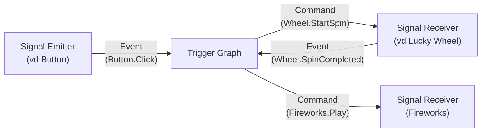
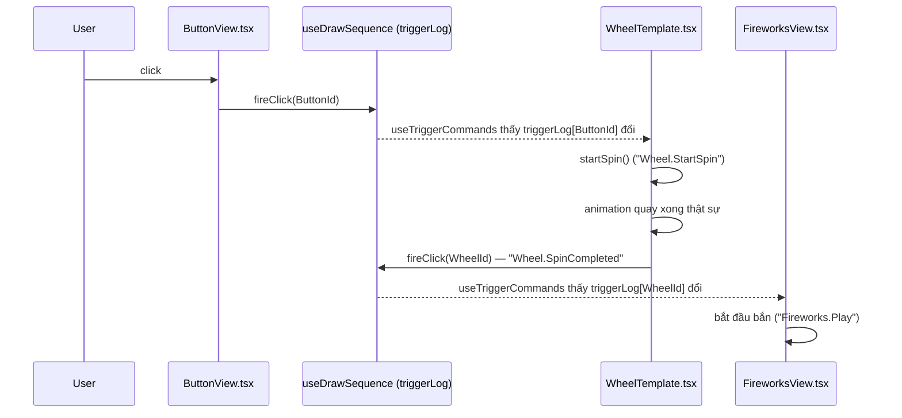

# GRAPH

Tài liệu này giải thích cách màn hình **Trigger Graph** trong Landing Builder hoạt động: ý nghĩa
các node/chấm màu trên sơ đồ, cách kéo-thả tín hiệu + nối dây để tạo 1 "trigger" (link), cách link
đó thực sự chạy lúc Present Mode, và 1 ví dụ hoàn chỉnh. Đọc file này trước khi sửa bất kỳ gì trong
`src/components/landing/triggerGraph/`.

## 1. SIGNAL EMITTER/SIGNAL RECEIVER

Đa số component trên Landing chỉ thuộc một trong hai nhóm (xem thêm CLAUDE.md, mục "Kiến trúc quan
trọng"):

| | Signal Emitter | Signal Receiver |
|---|---|---|
| Presenter trong Present Mode? | Có (click, quét QR...) | Không |
| Việc nó làm | CHỈ phát ra 1 Event | CHỈ nhận Command rồi tự chạy animation/logic của chính nó |
| Biết gì về phần còn lại của app? | Không biết gì cả — Button không biết Draw/Wheel/Fireworks là gì | Không biết Command đến từ đâu — Wheel không biết ai bấm nút nào |
| Ví dụ hiện có | **Button** (phát `Button.Click`) | **Lucky Wheel**, **Fireworks**, **Stage Light**, **Link Opener**, **Draw**, **Confirm Winner** |
| Ví dụ tương lai | QR Scanner, NFC Reader, Keyboard Shortcut | Countdown, Winner Banner, Prize Image, Scoreboard, Video, Music |

**Ngoại lệ hẹp**: 1 Receiver có thời lượng hoàn thành KHÔNG cố định (tuỳ cấu hình animation, hoặc
tuỳ 1 lời gọi IPC bất đồng bộ) được phép có thêm ĐÚNG 1 emit báo "vừa xong việc nó được giao" —
**Lucky Wheel** vừa `listensFor "Wheel.StartSpin"` (Receiver) vừa `emits "Wheel.SpinCompleted"`
(Emitter), bắn ra ngay tại điểm animation quay THẬT SỰ kết thúc (xem mục 7). Nhờ vậy nối chuỗi được
(vd Wheel quay xong → Fireworks bắn) mà không phải đoán 1 khoảng delay cố định rồi hy vọng khớp —
nhất là với template Digit Roller, thời điểm quay xong không cố định (tuỳ
`revealTiming`/`revealStaggerMs`), 1 delay đoán trước không bao giờ khớp chính xác được. **Draw**
là ví dụ thứ 2: vừa `listensFor "Draw.Pick"` vừa `emits "Draw.Picked"`, bắn ra CHỈ SAU KHI
`sequence.pick()` (1 lời gọi IPC tới SQLite) thật sự resolve thành công — cùng lý do, chỉ khác là
"thời lượng không cố định" ở đây đến từ độ trễ IPC/DB thay vì animation (xem `DrawView.tsx`, và
`docs/landing-builder.md` mục Actions để hiểu vì sao Draw/Confirm Winner tồn tại). Đây KHÔNG phải
"component tự do vừa Emitter vừa Receiver" — chỉ áp dụng cho đúng 1 tín hiệu
hoàn-thành-việc-của-chính-nó.

**Trigger Graph là tầng trung gian DUY NHẤT nối Emitter và Receiver:**



Graph **không biết** Lucky Wheel quay kiểu gì hay Fireworks bắn ra sao — nó chỉ định tuyến
Event → Command. Toàn bộ logic "nhận lệnh thì làm gì" nằm trong chính component nhận lệnh.

## 2. CANVAS

Mở Trigger Graph (nút biểu tượng đồ thị ở toolbar Builder). Canvas hiển thị **ngay** 1 Component
Node cho mỗi component Emitter/Receiver đang có trên trang — không cần kéo-thả gì thêm để chúng
xuất hiện. Có 2 loại node:

### 2.1. Component Node

Đại diện 1 component thật trên Landing — **chỉ icon + tên**, không có chấm/badge tín hiệu nào hiện
ra. Nó đóng 2 vai trò: **điểm neo** để thả 1 signal chip vào (xem 2.2), và tự vẽ 1 **đường "sở
hữu"** (xem 2.3) sang mỗi chip của chính nó — bản thân Component Node không tự nối dây thật được
(không kéo tay ra khỏi nó để tạo `TriggerAction`). Component thuộc nhóm nào (Emitter/Receiver/cả
2 với ngoại lệ hẹp — xem mục 1) quyết định nó neo được chip ở phía nào: chip Emit luôn neo bên
PHẢI, chip Listen luôn neo bên TRÁI — Lucky Wheel (vừa Emitter vừa Receiver) neo được CẢ 2 phía
cùng lúc.

Những loại component không phải Emitter lẫn Receiver (Text, Image, Countdown, Prize List...) **sẽ
không xuất hiện trên Trigger Graph** — bị lọc bỏ hoàn toàn vì không có gì để nối dây.

### 2.2. Signal Chip Node

1 "chip" nhỏ, tách rời khỏi Component Node, đại diện đúng **1 tín hiệu đã được kéo ra** cho 1
component cụ thể (`SignalChipPlacement`) — có thể CHƯA nối dây với gì cả. Chip có **1 chấm màu**
dùng để kéo dây thật:

- **Chip Emit** (viền + chấm màu **XANH NHẠT**, `teal-500` = `#20C7F1`, nằm bên PHẢI chip) — chấm
  này là cổng **PHÁT**, kéo dây BẮT ĐẦU từ đây. Chỉ đặt được lên component là Signal Emitter (vd
  Button) — mặc định chip loại này luôn hiện bên PHẢI component chủ.
- **Chip Listen** (viền + chấm màu **XANH ĐẬM**, `gold-500` = `#2244A5` trong theme — tên biến
  "gold" chỉ là kế thừa từ bản theme cũ, không phải nghĩa đen, nằm bên TRÁI chip) — chấm này là cổng
  **NHẬN**, kéo dây KẾT THÚC ở đây. Chỉ đặt được lên component là Signal Receiver (vd Lucky
  Wheel/Fireworks/Stage Light) — mặc định chip loại này luôn hiện bên TRÁI component chủ.

Chữ hiển thị trên chip chính là tên tín hiệu (vd `Button.Click`, `Wheel.StartSpin`). 1 component có
thể có nhiều chip (Fireworks có thể có cả chip `Fireworks.Play` lẫn `Fireworks.Stop` cùng lúc nếu
cả 2 đều được kéo ra) — mỗi tín hiệu là 1 chip riêng, không gộp chung vào Component Node như trước.

Chip **chưa nối dây với gì** vẫn tồn tại bình thường trên canvas (không tự biến mất) — chỉ là chưa
tạo ra `TriggerAction` nào cho tới khi được nối với 1 chip khác.

### 2.3. Connector — 2 kiểu đường, ý nghĩa khác nhau

- **Đường "sở hữu"** (nét LIỀN, mờ, xám nhạt) — TỰ ĐỘNG vẽ ngay khi 1 chip xuất hiện, nối Component
  Node với MỌI chip của chính nó. Đây chỉ là gợi ý hiển thị "chip này thuộc component nào", không
  phải dữ liệu — không click/xoá được (xoá phải xoá chính chip, xem mục 3).
- **Đường TriggerAction thật** (nét ĐỨT, đậm hơn) — chỉ xuất hiện SAU KHI đã kéo dây nối 2 chip với
  nhau ở bước 2 (xem mục 3). Đây mới là link thật sự chạy lúc Present Mode.

Cả 2 loại đường đều vẽ theo kiểu **`straight`** (1 đường thẳng nối trực tiếp 2 điểm neo, không bẻ
góc vuông).

**Vị trí mọi node KÉO TAY được** (Component Node lẫn Signal Chip Node), lưu vào
`config.triggerGraph.nodePositions` khi kéo — chỉ là bố cục hiển thị, không ảnh hưởng gì tới cách
link chạy lúc Present Mode. 1 node **CHƯA từng bị kéo tay** thì được đặt vào 1 vị trí mặc định hợp lý
tự tính từ chính đồ thị tín hiệu (`computeComponentRanks`/`computeComponentLanes` trong
`TriggerGraphEditor.tsx`), giống cách 1 journey builder (vd CDP) tự xếp sơ đồ ban đầu:

- **Rank (cột)** — cột 0 là những component KHÔNG bị component nào khác kích hoạt (thường là
  Emitter gốc, vd Button); 1 component bị kích hoạt bởi component khác thì đứng ở cột =
  (cột của component nguồn) + 1. Nhờ vậy chuỗi `Button → Lucky Wheel → Fireworks` tự xếp thành 3
  cột trái→phải đúng thứ tự tín hiệu thật chạy qua, không phải thứ tự thêm component vào trang.
- **Lane (hàng)** — 1 component mặc định GIỮ NGUYÊN hàng của component nguồn đã kích hoạt nó (chuỗi
  chính luôn nằm thẳng 1 hàng ngang — "trunk"), trừ khi hàng đó ở cột này đã có component khác
  chiếm mất thì rơi xuống hàng trống tiếp theo.

Vị trí mặc định này chỉ là điểm khởi đầu — kéo bất kỳ node nào đi thì vị trí đã kéo LUÔN được ưu
tiên (lưu trong `nodePositions`) cho tới khi bị xoá. Xem mục 4 về các cơ chế hỗ trợ kéo tay cho gọn
gàng (lưới + smart guide).

## 3. Cách đặt tín hiệu ra canvas và nối dây — kéo-thả 2 bước

Toàn bộ việc tạo link giờ là **kéo-thả 2 bước liên tiếp**, không còn form dropdown nào:

**Bước 1 — kéo tín hiệu từ sidebar trái ra 1 Component Node.** Sidebar (`TriggerSidebar.tsx`) mục
"Signals" liệt kê MỌI tín hiệu (`emits`/`listensFor`) của các loại component **đang thật sự có mặt**
trên trang (vd trang có Button + Lucky Wheel thì sidebar hiện đúng 2 chip kéo được: `Button.Click`
và `Wheel.StartSpin`). Kéo 1 tín hiệu thả **đúng vào** Component Node hỗ trợ nó → tạo ra 1 Signal
Chip Node neo cạnh component đó (xem 2.2). 1 tín hiệu kéo được nhiều lần (thả vào nhiều instance
khác nhau nếu trang có nhiều Button/nhiều Lucky Wheel).

**Bước 2 — nối dây giữa 2 chip.** Kéo từ chấm của 1 chip **Emit** sang chấm của 1 chip **Listen**
(khác component) → tạo ra 1 `TriggerAction` thật, hiện ngay dưới dạng đường nét đứt nối 2 chip.

Bất kỳ thao tác nào không hợp lệ đều hiện **1 thông báo lỗi chi tiết** (thẻ đỏ, tự biến mất sau 4s)
thay vì âm thầm bỏ qua — vd:

- Thả tín hiệu vào khoảng trống (không phải component nào).
- Thả tín hiệu vào 1 component không hỗ trợ nó (vd thả `Wheel.StartSpin` vào Button).
- Thả 1 tín hiệu đã có sẵn chip trên ĐÚNG component đó rồi.
- Nối 2 chip cùng vai trò (2 Emit với nhau, hoặc 2 Listen với nhau).
- Nối 1 component với chính nó.
- Nối lại 2 chip đã từng nối với nhau rồi.

**Xoá 1 chip**: chọn chip (click) rồi bấm dấu "×" nhỏ hiện ở góc — xoá kéo theo LUÔN mọi
`TriggerAction` đang dùng chip đó (làm nguồn hoặc làm đích), tránh link mồ côi không còn điểm neo
để vẽ.

**Sidebar mục "Connections"** vẫn còn, dùng để XEM/SỬA/XOÁ các link đã nối dây (không dùng để TẠO
mới nữa) — click 1 dòng để sửa Delay (ms) hoặc bấm "Delete link".

## 4. Toolbar: Select / Hand tool, Gridline, smart guide

Trigger Graph dùng chung 2 nút Select/Hand VÀ nút Gridline với Canvas thường (góc trái trên, dịch
sang phải 1 chút để không đè lên sidebar) — mỗi màn hình tự vẽ lưới bằng cơ chế riêng (Canvas: CSS
gradient; Graph: chấm nền `<Background>` của react-flow) nhưng dùng chung 1 state `showGrid` nên bật
tắt 1 lần là áp dụng cho cả 2 màn hình:

- **Select** (mặc định) — click chọn node (vd để hiện nút "×" xoá chip), kéo node để di chuyển
  (xem "smart guide" bên dưới), kéo nền để pan, kéo giữa 2 chấm chip để nối dây.
- **Hand** (phím tắt `H`) — CHỈ pan, khoá hẳn chọn/kéo/nối node (giống Hand tool bên Canvas thường).
  Dùng khi sơ đồ nhiều node, muốn dạo quanh xem mà không sợ vô tình kéo lệch vị trí 1 node, nối
  nhầm dây, hoặc xoá nhầm chip.
- **Gridline** — chỉ bật/tắt lưới NHÌN THẤY, không liên quan gì tới việc có bắt dính lưới hay không
  (xem ngay dưới) — giống hệt cách toggle này hoạt động bên Canvas (`LandingCanvas.tsx`).

**Bắt dính lưới (`snapToGrid`)** — LUÔN bật khi kéo bất kỳ node nào (độc lập với nút Gridline ở
trên), mọi node kéo xong luôn dừng đúng 1 ô lưới `GRID_SIZE = 40px`, không rơi tự do ở toạ độ lẻ.

**Smart guide** — lúc kéo 1 node, Trigger Graph tự so khớp cạnh trái/tâm/cạnh phải (trục X) và cạnh
trên/tâm/cạnh dưới (trục Y) của node đang kéo với TỪNG node khác đang có trên canvas
(`computeDragSnap` trong `TriggerGraphEditor.tsx`). Khớp trong 1 ngưỡng nhỏ (quy đổi theo zoom hiện
tại, luôn "cảm giác" 8px màn hình dù đang zoom mức nào) thì node bắt dính CHÍNH XÁC vào giá trị đó
và hiện 1 đường guide màu đỏ full chiều ngang/dọc màn hình tại vị trí khớp — cùng ngôn ngữ hình ảnh
với center-snap của Canvas (`LandingCanvas.tsx`), chỉ khác điểm so khớp là node GẦN NHẤT thay vì 1
tâm canvas cố định (Trigger Graph là canvas vô hạn, không có kích thước cố định để lấy tâm). Vd kéo
Fireworks lại gần Lucky Wheel, khi tâm-Y của 2 node thẳng hàng, 1 đường guide ngang hiện ra và
Fireworks bắt dính đúng hàng đó.

## 5. Save / Discard

Trigger Graph **không có Save/Discard riêng** — mọi thay đổi (kéo chip ra, nối/xoá dây, kéo vị trí
node) ghi thẳng vào `config` chung của cả Landing Builder, giống hệt sửa trên Canvas thường. Nút
**Save** và **Discard** ở góc phải trên cùng của cửa sổ Builder áp dụng cho TOÀN BỘ thay đổi (cả
Canvas lẫn Graph):

- **Save** — ghi `config` xuống DB (`window.api.sessions.updateLandingConfig`).
- **Discard** — hỏi xác nhận, rồi khôi phục `config` về đúng bản đã Save gần nhất (huỷ hết mọi thay
  đổi chưa lưu, không phân biệt Canvas hay Graph).
- Đóng cửa sổ Builder khi còn thay đổi chưa Save cũng bị chặn lại bằng 1 hộp thoại cảnh báo native
  của Electron (xem `electron/main.ts`, sự kiện `close` của `landingBuilderWindow`).

## 6. Dữ liệu đứng sau — `TriggerAction`, `SignalChipPlacement`, `COMPONENT_SIGNALS`

```ts
// src/lib/landing/types.ts
export interface TriggerAction {
  id: string;
  sourceComponentId: string; // component nào PHÁT tín hiệu (1 Button cụ thể)
  sourceSignal: string;      // tín hiệu emit cụ thể của nguồn, vd "Button.Click"
  delayMs: number;
  command: string;           // tên Command, vd "Wheel.StartSpin" — tra hợp lệ qua COMPONENT_SIGNALS
}

// Ghi lại 1 chip ĐÃ ĐƯỢC KÉO RA canvas — độc lập với đã nối dây hay chưa.
export interface SignalChipPlacement {
  id: string; // `${ownerComponentId}::${signal}`
  ownerComponentId: string;
  signal: string;
  role: "emit" | "listen";
}

export interface TriggerGraphLayout {
  nodePositions?: Record<string, { x: number; y: number }>; // key = component.id hoặc chip.id
  signalChips?: SignalChipPlacement[];
}
```

`TriggerAction` được lưu trong **chính component ĐÍCH nhận lệnh**
(`component.triggerActions?: TriggerAction[]`) — không lưu ở component nguồn. `SignalChipPlacement`
được lưu chung trong `config.triggerGraph.signalChips` — đây là danh sách "đã kéo tín hiệu nào ra
canvas", tách biệt với "đã nối dây thành `TriggerAction` chưa".

```ts
// src/components/landing/componentRegistry.ts
export interface ComponentSignals {
  emits?: string[];      // Event component loại này CÓ THỂ phát (chỉ Emitter có field này)
  listensFor?: string[]; // Command component loại này HIỂU (chỉ Receiver có field này)
}

export const COMPONENT_SIGNALS: Partial<Record<LandingComponentType, ComponentSignals>> = {
  button: { emits: ["Button.Click"] },
  // Ngoại lệ hẹp (xem mục 1) — vừa nhận lệnh quay vừa tự báo khi quay xong.
  luckyWheel: { listensFor: ["Wheel.StartSpin"], emits: ["Wheel.SpinCompleted"] },
  fireworks: { listensFor: ["Fireworks.Play", "Fireworks.Stop"] },
  stageLight: { listensFor: ["StageLight.Play", "StageLight.Stop"] },
};
```

`COMPONENT_SIGNALS` là nguồn dữ liệu DUY NHẤT cho cả sidebar (tín hiệu nào kéo được) lẫn validate
lúc thả chip (thả đúng component chưa) — không có tên tín hiệu tự gõ tuỳ ý, nên không bao giờ gõ
lệch tên giữa 2 đầu khiến link không khớp. Tên luôn theo quy ước **`Component.Action`** (vd
`Wheel.StartSpin`, không phải `startSpin` hay `WHEEL_START`).

## 7. Chạy thật lúc Present Mode — `useTriggerCommands.ts`

Đây là phần **không hiện ra trên sơ đồ** nhưng quyết định link có thực sự chạy hay không:

1. `sequence.fireClick(component.id)` (xem `useDrawSequence.ts`) là điểm ghi tín hiệu DÙNG CHUNG
   cho MỌI Emitter — không chỉ Button. Khi 1 Button được bấm, `ButtonView.tsx` gọi hàm này (Button
   **không** tự gọi bất kỳ IPC hay logic nào khác — đúng tinh thần Signal Emitter thuần). Với
   Lucky Wheel (ngoại lệ hẹp, xem mục 1), chính `WheelTemplate.tsx`/`DigitRollerTemplate.tsx` cũng
   gọi ĐÚNG hàm này tại điểm animation quay THẬT SỰ kết thúc, để phát `Wheel.SpinCompleted`. Mỗi
   lần gọi ghi lại "component này vừa phát tín hiệu" kèm mốc thời gian vào `triggerLog` (1 sổ ghi
   `{ [componentId]: { firedAt } }`).
2. Mỗi component Receiver (Lucky Wheel/Fireworks/Stage Light) tự gọi hook `useTriggerCommands` với
   MẢNG `triggerActions` của chính nó:
   ```ts
   useTriggerCommands(component.triggerActions, sequence, (command) => {
     if (command === "Wheel.StartSpin") startSpin();
   });
   ```
3. Hook này, cho từng `TriggerAction`, tra `triggerLog[action.sourceComponentId]` — nếu ĐÚNG
   component nguồn đó vừa phát tín hiệu (và chưa dispatch cho lần phát này), đợi đủ `delayMs` rồi
   gọi `onCommand(action.command)` **đúng 1 lần**.
4. Component nhận lệnh tự quyết định `command` đó nghĩa là gì (vd `WheelTemplate.tsx` bắt đầu quay
   khi thấy `"Wheel.StartSpin"`) — hook và Graph không biết, không cần biết.



Ở Builder (không phải Present Mode thật), `sequence` là `undefined` nên hook này luôn no-op — mọi
Receiver hiện khung tĩnh (preview), không tự chạy gì.

## 8. Ví dụ hoàn chỉnh: nối Button "Draw" → cho Lucky Wheel quay

1. Kéo 1 **Button** vào Landing (Properties Panel: đặt tên duy nhất, vd "Draw" — Button không còn
   chọn "action" nào cả, chỉ có tên + màu sắc).
2. Kéo 1 **Lucky Wheel** vào Landing, cấu hình field hiển thị/field trúng như bình thường.
3. Mở **Trigger Graph** — canvas tự hiện 2 Component Node: "Draw" và "Lucky Wheel". Sidebar trái
   mục "Signals" hiện 2 chip kéo được: `Button.Click` và `Wheel.StartSpin`.
4. Kéo `Button.Click` thả vào Component Node "Draw" → xuất hiện 1 Signal Chip Node (xanh nhạt) neo
   cạnh "Draw".
5. Kéo `Wheel.StartSpin` thả vào Component Node "Lucky Wheel" → xuất hiện 1 Signal Chip Node (xanh
   đậm) neo cạnh "Lucky Wheel".
6. Kéo dây từ chấm của chip `Button.Click` sang chấm của chip `Wheel.StartSpin` → tạo 1
   `TriggerAction` (delay mặc định 0ms), hiện ngay đường nét đứt nối 2 chip. Sidebar mục
   "Connections" cũng hiện dòng "Draw → Lucky Wheel: Wheel.StartSpin" — click vào để chỉnh Delay
   nếu cần.
7. Bấm **Save** (góc phải trên) để ghi xuống DB.
8. Mở Present Mode, bấm nút Draw → Lucky Wheel bắt đầu quay.

Lưu ý: bản thân việc "chọn ai trúng" (gọi `draw:pick`) **không nằm trong bước này** — đó vẫn là
việc riêng của `useDrawSequence.ts`/Draw Engine, độc lập hoàn toàn với Trigger Graph. Trigger Graph
chỉ quyết định **khi nào Lucky Wheel bắt đầu chạy animation quay**, không quyết định ai thắng.

### 8.1. Biến thể: Button "Xem thông tin" → mở URL của winner (Link Opener)

`Link Opener` tái tạo lại tính năng Button action "openLink" cũ (đã xoá khi Button trở thành Emitter
thuần) mà không cần Button biết gì về Draw/winner:

1. Kéo 1 **Link Opener** vào Landing (không cần đặt vị trí đẹp — component này vô hình ở Present
   Mode, chỉ hiện khung chấm chấm để chọn/kéo lúc ở Builder).
2. Properties Panel của Link Opener: chọn **URL field** — 1 cột `extra_data` do người tổ chức tự
   nhập cho từng participant (vd 1 cột chứa link Facebook post) hoặc field cố định (Code/Phone/
   Email/Name).
3. Mở **Trigger Graph**, kéo `Button.Click` (từ Button "Xem thông tin" chẳng hạn) và
   `LinkOpener.Open` ra canvas, nối dây giữa 2 chip — y hệt bước 3-6 ở ví dụ trên.
4. Bấm **Save**, vào Present Mode: bấm nút TRƯỚC khi có kết quả xác nhận nào — **không có gì xảy
   ra** (Link Opener tự no-op im lặng vì `data.results` rỗng, xem `LinkOpenerView.tsx`). Sau khi
   quay + Confirm ra 1 winner, bấm lại nút → trình duyệt mặc định của hệ điều hành mở đúng URL lấy
   từ field đã chọn, của ĐÚNG participant vừa trúng gần nhất (`data.results[0]`).

Không có bất kỳ "trạng thái disabled" nào lộ ra trên Button — nút luôn bấm được và luôn phát
`Button.Click`, việc "chưa có gì để mở thì không làm gì" là trách nhiệm của Receiver, không phải
của Emitter (giữ đúng nguyên tắc Button không biết gì về Draw/winner).

## 9. Thêm 1 loại Emitter/Receiver mới

Xem checklist đầy đủ ở đầu `src/lib/landing/types.ts` (bước 0 trong đó). Tóm tắt riêng cho phần
Trigger Graph: khai báo `emits` (nếu là Emitter) hoặc `listensFor` (nếu là Receiver, KHÔNG BAO GIỜ
cả 2) cho loại component mới trong `COMPONENT_SIGNALS` (`componentRegistry.ts`) — chỉ cần đúng
bước này là component đó tự động xuất hiện trên Trigger Graph, và tín hiệu của nó tự động xuất hiện
trong sidebar để kéo-thả, không cần sửa gì thêm trong `TriggerGraphEditor.tsx`/`TriggerSidebar.tsx`.

## 10. File liên quan

| File | Vai trò |
|---|---|
| `src/lib/landing/types.ts` | Định nghĩa `TriggerAction`, `SignalChipPlacement`, `TriggerGraphLayout` |
| `src/components/landing/componentRegistry.ts` | `COMPONENT_SIGNALS` — từ vựng Emitter/Receiver |
| `src/components/landing/triggerGraph/TriggerGraphEditor.tsx` | Canvas react-flow chính — ghép node/edge từ `config`, xử lý kéo-thả chip + nối dây + validate + thông báo lỗi |
| `src/components/landing/triggerGraph/TriggerSidebar.tsx` | Sidebar trái — bảng tín hiệu kéo-thả được + danh sách Connections (xem/sửa Delay/xoá) |
| `src/components/landing/triggerGraph/ComponentNode.tsx` | Vẽ 1 Component Node (icon + tên, không chấm) |
| `src/components/landing/triggerGraph/SignalChipNode.tsx` | Vẽ 1 Signal Chip Node (1 chấm, màu theo vai trò emit/listen) |
| `src/components/landing/triggerGraph/componentIcons.tsx` | Icon riêng cho từng loại component trên Graph |
| `src/components/landing/useTriggerCommands.ts` | Hook dispatch Command lúc Present Mode |
| `src/components/landing/useDrawSequence.ts` | `triggerLog`/`fireClick` — sổ ghi Event của Button |
| `src/pages/LandingBuilderWindow.tsx` | Toolbar Select/Hand, nút Save/Discard chung, bật/tắt Graph mode |
