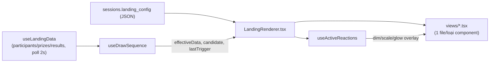

# Present Mode vs Builder canvas

## Pipeline render

`LandingRenderer` là **painter thuần** — không state, không tương tác — dùng lại y nguyên bởi
`LandingCanvas` (Builder, `interactive` mặc định `false`) và `PresentMode.tsx` (`interactive=true`),
đảm bảo 2 nơi không bao giờ vẽ lệch nhau.

## Khác biệt theo prop `interactive`

Cả 2 dùng chung `LandingRenderer.tsx`, khác nhau ở prop `interactive`:

- **`interactive=true`** (chỉ Present Mode): `sequence` thật (không phải `undefined`) được truyền
  xuống — Button mới bấm được, action mới chạy thật (xem [button-actions.md](./button-actions.md));
  `hiddenInBuilder` bị phớt lờ (khán giả luôn thấy đúng những gì config khai báo); Scoreboard vẽ như
  1 modal riêng canh giữa màn hình, chỉ hiện khi `sequence.scoreboardVisible`.
- **`interactive=false`** (Builder canvas): `sequence` là `undefined` → Button tự disable (không
  bấm được, tránh chạy quay số thật lúc đang chỉnh sửa) — Scoreboard vẽ tại chỗ theo x/y như mọi
  component khác (để còn kéo/resize được). Lucky Wheel vẫn tự dò `results[0].id` như ở Present Mode,
  nhưng Builder không truyền `data` thật xuống Canvas nên trong thực tế nó luôn đứng yên ở đó.

Đây cũng là ranh giới bắt buộc phải tôn trọng khi thêm 1 effect/component mới có animation thật —
xem quy tắc chi tiết ở [effects.md](./effects.md) mục 2 (`interactive=false` LUÔN hiện khung tĩnh,
không chạy animation loop thật).

## Cảnh báo "Column not found" — chỉ ở Builder canvas

`availableParticipantColumns(participants)` (`src/lib/landing/types.ts`) tính tập cột Participant
THỰC SỰ còn tồn tại (4 field cố định + hợp nhất mọi key `extra_data` đang dùng);
`missingColumnBindings(component, available)` đối chiếu 3 chỗ hay bind 1 cột optional cụ thể — Lucky
Wheel (`drawField`/`displayField`/`winnerDisplayField`), Scoreboard (`columns`), Button action
`openLink` (`urlField`) — trả về danh sách cột không còn tồn tại (đã bị xoá ở Data Editor, xem
[participants/data-editor.md](../participants/data-editor.md)).

`LandingRenderer.tsx` chỉ tính + hiện badge đỏ "⚠ Column not found: x" này khi `builderPreview`
(canvas Builder) — KHÔNG hiện ở Present Mode thật, để không làm rối buổi quay đang chạy.

**Bug đã sửa: Scoreboard luôn báo oan "Column not found" cho 6 field mặc định** — `Scoreboard.columns`
trộn lẫn 2 hệ tên khác hẳn nhau: 6 field CỐ ĐỊNH (`SCOREBOARD_FIELDS` — `participantName`/
`participantCode`/`participantPhone`/`participantEmail`/`prizeName`/`prizeCategory`) không phải tên
cột Participant thật, mà là khoá resolve THẲNG từ `DrawResultRow`/`Prize` (xem `valueOf` trong
`TableTemplate.tsx` — vd `participantName` → `r.participant_name`, `prizeCategory` → tra
`data.prizes`), và cột optional (`extra_data`) người dùng tự thêm SAU 6 field đó. `missingColumnBindings`
trước đây đối chiếu CẢ 6 field cố định này với `availableParticipantColumns` (tập tên cột Participant
thật) — sai hoàn toàn vì 2 hệ tên không bao giờ trùng nhau (`"participantName"` không phải
`"name"`), khiến MỌI Scoreboard bật cột mặc định (kể cả session dữ liệu hoàn toàn bình thường) đều bị
báo đỏ oan. Sửa bằng cách loại 6 field trong `SCOREBOARD_FIELDS` khỏi việc kiểm tra tồn tại — chỉ còn
cột optional thật sự cần đối chiếu.

## Bug đã sửa: mở lại 1 phiên đã quay dở thì tự nhảy hiện winner cũ

Mở Present Mode/`LandingPage.tsx` cho 1 session đã có `draw_results` từ trước: `effectiveData` lúc
CHƯA có `candidate` (`useDrawSequence.ts`) trả thẳng `data` — `data.results` lúc đó là **toàn bộ lịch
sử từ DB**, không phải "kết quả mới". Mọi component tự-quay/tự-hiện lại chỉ nhìn `results[0]?.id` để
quyết định "có nên chạy hay không" nên hiểu nhầm dòng lịch sử cũ là 1 kết quả mới: Digit Roller/Wheel
tự quay, Winner Name tự hiện tên — vài giây sau khi mount, dù chưa ai bấm Draw.

Sửa bằng `isLiveDrawResultId(id)` = `id?.startsWith("pending-")` (hằng `PENDING_RESULT_ID_PREFIX`
trong `src/lib/landing/types.ts`) — chỉ dòng LIVE (đang có 1 lượt Draw thật trong phiên Present hiện
tại, id do `effectiveData` độn vào) mới coi là "có kết quả để phản ứng". Áp dụng ở
`WheelTemplate`/`DigitRollerTemplate` (điều kiện bắt đầu quay), `WinnerNameView`/`TextView` (feed
`useRevealed` một id LIVE-only, id khác thì luôn `undefined` = Idle), và `LandingRenderer`
(remount-on-result key = id LIVE hoặc `"idle"`). Kết quả: mở
Landing/Present luôn về màn hình Idle; ai muốn xem lịch sử trúng thưởng thì mở Scoreboard.

**Quyết định sản phẩm liên quan (đừng làm lại)**: KHÔNG xây tính năng "khôi phục winner gần nhất khi
mở lại 1 phiên" — dù kỹ thuật khả thi (winner đã Confirm nằm sẵn trong `draw_results`), đã cân nhắc
và từ chối vì Scoreboard đã đủ để xem lại lịch sử trúng thưởng.

## Winner Name (syncWithDraw luôn bật) — 3 trạng thái Idle/Revealed/Disappear

`useRevealed` (`drawRevealHooks.ts`, dùng bởi `WinnerNameView.tsx`) luôn ở đúng 1 trong 3 trạng thái,
**hoàn toàn tự quản lý qua 2 field của CHÍNH component đó** (`appearDelayMs`/`disappearDelayMs`, đặt
ở Properties Panel — xem `WinnerNameProps` trong `types.ts`), KHÔNG còn phụ thuộc thời lượng quay của
Lucky Wheel trên trang (model cũ dùng `computeWheelRevealDelayMs` đã bỏ hẳn — công thức đó không tính
đúng tuyệt đối cho mọi hiệu ứng quay, đặc biệt Reel/Flicker của Digit Roller):

1. **Idle** (chưa Draw lần nào): không hiện gì, không delay nào áp dụng — chưa từng rời Idle thì
   không có gì để "quay về" cả.
2. **Draw lần đầu**: giữ "" cho tới đúng `appearDelayMs` tính từ lúc bấm Draw (`resultId` đổi), rồi
   `appearEffect` chạy để hiện tên.
3. **Draw lần tiếp theo** (đang hiện của lượt trước): chuỗi CŨ đứng yên tại chỗ cho tới đúng
   `disappearDelayMs` (tính từ CÙNG mốc bấm Draw) thì `disappearEffect` mới chạy để nó biến mất —
   ĐỘC LẬP, không xếp hàng chờ, chuỗi MỚI cũng hiện sau đúng `appearDelayMs` tính từ mốc đó.

`value` (winnerName) chỉ được đọc vào ĐÚNG lúc mỗi timer chạy (qua closure của effect) — không hiện
ngay dù giá trị nguồn đã đổi tức thì lúc bấm Draw, tránh bug "tên MỚI nhảy vào chỗ tên CŨ" trước khi
Disappear kịp chạy (bản chất chính là bug "flash tên mới khi Redraw" đã từng gặp ở bản cũ, nay được
giải quyết TRIỆT ĐỂ hơn — không chỉ reset `revealed` trong render mà còn tách hẳn timing
Appear/Disappear thành 2 field độc lập).

**Reset ép về Idle bằng ĐÚNG 1 phase, không suy luận qua `resultId`**: `DrawSequenceActions.resetSeq`
(`useDrawSequence.ts`) tăng thêm 1 mỗi lần `resetSession()` chạy xong thật sự — `useRevealed` phát
hiện thay đổi này NGAY TRONG RENDER (ghi vào 1 ref, `firedPhaseRef.current = "idle"`), rồi xử lý THẬT
SỰ (setState) bên trong `useEffect` khoá theo `fireKey` (chuỗi ghép từ `resultId`/`resetSeq`, ĐÚNG
kiến trúc `useDrawCycleVisibility` dùng cho Image/Text) — KHÔNG còn setState-trong-render như bản
trước (từng gây bug thật: `useRevealTransition` suy luận "có phải do Reset không" bằng cách so sánh
riêng `resetSeq` của chính nó, nhưng `text` chỉ thật sự đổi SAU KHI effect của `useRevealed` chạy
xong — CÓ THỂ ở 1 lượt render KHÁC hẳn với lượt `resetSeq` đổi — nên so sánh tách rời luôn có nguy cơ
lệch nhịp, khiến Reset bị nhầm dùng hiệu ứng/delay của Redraw thường thay vì của Idle). Tín hiệu tường
minh này bảo đảm Winner Name luôn về đúng trạng thái mới-vào-landing sau Reset, bất kể đang
Idle/Revealed/Disappear lúc bấm — **TRỪ KHI `idleState === "appear"`** (xem ngay dưới đây), lúc đó
bước này bị BỎ QUA HOÀN TOÀN để tên tiếp tục hiển thị nguyên vẹn qua Reset.

`useRevealed` trả về `{ text, phase }` (`RevealState`, `drawRevealHooks.ts`) thay vì 1 chuỗi trần —
`phase` (`"idle" | "draw" | "redraw" | null`) LUÔN cập nhật ĐỒNG THỜI với `text` trong CÙNG 1 lần
setState, nên bất kỳ hook/component nào cần biết "text này đổi VÌ SAO" (vd `useRevealTransition` cần
biết có phải Idle/Reset không để chọn `idleEffect` thay vì `disappearEffect`) chỉ cần ĐỌC THẲNG
`phase` từ state đó — không bao giờ lệch nhịp, vì 2 giá trị luôn thuộc CÙNG 1 lần render.

**`idleState` (`DrawRestState` — cùng type với `ImageProps`/`TextProps.drawCycle.idleState`) — CÓ hay
KHÔNG ẩn tên khi Reset**: mặc định/`undefined` = `"disappear"` (hành vi ở trên, không đổi gì). Đặt
`"appear"` thì Reset (`resetSeq` đổi) hoàn toàn KHÔNG đụng tới tên đang hiện — dùng khi muốn tên người
trúng gần nhất tiếp tục hiển thị trang trí cho tới khi có lượt Draw mới, thay vì biến mất ngay khi bấm
Reset. Field này KHÔNG ảnh hưởng gì tới lúc MỞ LẠI landing (`useRevealed` luôn khởi tạo
`useState({text: "", phase: null})` — rỗng ngay từ đầu, tách biệt hoàn toàn khỏi `idleState`) — giữ
đúng quyết định sản phẩm "Landing luôn mở ở Idle, không restore winner cũ" đã chốt trước đó,
`idleState="appear"` CHỈ có tác dụng cho việc bấm nút Reset GIỮA phiên, không phải lúc khởi động app.

**`idleEffect`/`idleDelayMs`** (Effect + Delay riêng, KHÁC `disappearEffect`/`disappearDelayMs` của
Redraw) CHỈ có tác dụng khi `idleState = "disappear"` — mô tả tốc độ/hiệu ứng NHÌN THẤY của lớp tên cũ
đang fade-out lúc Reset (`useRevealTransition`, đọc qua tham số `viaIdle` — CHÍNH LÀ
`revealState.phase === "idle"`, xem WinnerNameView.tsx). `idleState = "appear"` thì 2 field này vô
nghĩa (không có gì đổi để chạy hiệu ứng). Mặc định `undefined` = ẩn NGAY, không hiệu ứng, giữ đúng
hành vi cũ — tên đang hiện có thể đứng yên thêm `idleDelayMs` rồi mới biến mất bằng `idleEffect` nếu
được cấu hình. `useRevealTransition` còn tự BỎ QUA việc giữ lớp tên cũ chờ hết `TRANSITION_MS` khi
`text` MỚI là chuỗi rỗng (Idle/Reset LUÔN vậy) — animation "appear" của Draw không có ý nghĩa gì khi
appear vào chỗ trống, nên không lấy nó làm lý do trì hoãn việc ẩn tên cũ.

Properties Panel của Winner Name (`LiveTextPanel.tsx`) tổ chức 3 mục **Idle**/**Draw**/**Redraw**
(2 mục sau đổi tên từ "When Revealed"/"When Disappear" cũ cho khớp thuật ngữ chung, xem mục dưới) —
mỗi mục CHỈ gồm đúng **Effect** + **Delay (ms)** — xem thêm [properties-panel.md](./properties-panel.md).

## `useDrawCycleVisibility` — model Idle/Draw/Redraw (Image, Text, Background)

`useRevealed` ở trên GẮN CỨNG "Appear = lúc có kết quả mới" và "Disappear = lúc kết quả cũ bị thay" —
đúng cho Winner Name (nội dung THẬT SỰ đổi theo từng lượt — tên người trúng khác nhau mỗi lần, không
có gì để hiện lúc Idle vì chưa có ai trúng cả) nhưng SAI cho 1 thứ TĨNH do người dùng tự đặt như Text
hay 1 ảnh trang trí generic như Podium (Image): hoàn toàn có thể muốn nó hiện SẴN lúc Idle rồi ẩn đi
lúc Draw đang diễn ra, tức là ĐẢO NGƯỢC chiều mặc định — model cũ không cấu hình được việc đó.

`useDrawCycleVisibility` (`drawRevealHooks.ts`, dùng bởi `ImageView.tsx`/`TextView.tsx`/
`BackgroundView.tsx` khi `syncWithDraw`, qua component chung `DrawCycleFields.tsx` ở panel — xem
properties-panel.md) tách đúng 3 mốc THẬT của quy trình quay — **Idle** (chưa Draw lần nào / vừa vào
Landing, hoặc vừa Reset), **Draw** (1 lượt Draw mới, đang KHÔNG hiện gì trước đó), **Redraw** (1 lượt
Draw mới, ĐANG hiện kết quả lượt trước). Mỗi mốc có 1 dropdown **Appearance**, nhưng KHÔNG cho tự do
chọn bừa (bản trước từng cho Idle bật cả Disappear lẫn Appear cùng lúc, tạo ra 2 hiệu ứng ĐỐI LẬP đua
nhau ngay lúc mới vào trang — vô nghĩa, vì Idle là trạng thái NGHỈ/mặc định ban đầu, chỉ có ĐÚNG 1 kết
quả cuối). Appearance có 4 giá trị PEER — `appear`/`disappear`/`dim`/`blur` (`DrawRestState` trong
`types.ts`) — nhưng Image/Text CHỈ cho chọn 2 giá trị đầu qua `allowedStates` truyền vào
`DrawCycleFields.tsx` (Background truyền đủ cả 4, xem properties-panel.md):
- **Idle** (`idleState` — `DrawRestState`, KHÔNG có "none" vì Idle luôn phải có 1 dáng vẻ mặc định):
  hiệu ứng đi kèm (`idleEffect`) chạy lúc QUAY VỀ idleState — CHỈ xảy ra khi Reset, KHÔNG BAO GIỜ chạy
  lúc trang vừa mở (chưa từng rời Idle thì không có gì để "quay về" cả — lúc mới vào Landing,
  `idleState` chỉ quyết định DÁNG VẺ TĨNH ban đầu, không có animation).
- **Draw** (`drawAction` — `DrawPhaseAction`, thêm giá trị `none`): dropdown vô hiệu hoá (disable)
  ngay lựa chọn TRÙNG `idleState` — chỉ còn `none` (Draw không đổi gì) hoặc 1 giá trị KHÁC idleState
  (domain 2 giá trị chỉ còn ĐÚNG 1 lựa chọn — ép luân phiên nhị phân y hệt bản cũ; domain 4 giá trị
  của Background còn NHIỀU lựa chọn hơn).
- **Redraw** (`redrawAction` — cùng type): dropdown vô hiệu hoá lựa chọn TRÙNG `drawAction` (nếu
  `drawAction !== "none"`, ngược lại TRÙNG `idleState`) — chỉ còn `none` (Redraw không đổi gì) hoặc 1
  giá trị khác giá trị đó. Khác `none` thì chạy `redrawEffect` để chuyển sang trạng thái Redraw chọn,
  rồi — NẾU `drawAction !== "none"` — TỰ ĐỘNG chạy tiếp bằng CHÍNH `drawEffect` để chuyển LẠI trạng
  thái Draw, SAU KHI `redrawEffect` chạy xong HẲN (nối tiếp thật, `delayMs` đo từ lúc đó chứ không
  phải từ lúc bấm Redraw) — không có field effect riêng cho bước "đổi lại" này, vì bản chất "công bố
  kết quả" là 1 hành động chung dù Draw lần đầu hay Redraw. Với domain 2 giá trị, quy tắc "khác
  drawAction" ⟺ "trùng idleState" (vì drawAction luôn bị ép khác idleState) — giống hệt bản cũ.

`DrawCycleFields.tsx` tự sửa `drawAction`/`redrawAction` mỗi khi đổi `idleState` nếu giá trị đang lưu
không còn hợp lệ (vd Draw đang `appear`, đổi Idle thành `appear` luôn thì Draw tự nhảy sang
`disappear`) — CHỈ tự chọn thẳng khi domain (2 giá trị, Image/Text) còn ĐÚNG 1 lựa chọn hợp lệ duy
nhất; domain rộng hơn (Background) không đoán bừa, reset về `none`. Không bao giờ để lại 1 cặp mốc
liền kề TRÙNG trạng thái nhau trong dữ liệu đã lưu.

Ví dụ Podium (idleState = `appear`): Idle hiện sẵn lúc đứng yên, Draw = `disappear` (ẩn đi khi bắt đầu
quay), Redraw = `disappear` (tự ẩn lại dùng `redrawEffect`) rồi tự động hiện lại (dùng CHÍNH
`drawEffect`) — người dùng chỉ cần chọn Appearance cho từng mốc (bị ràng buộc sẵn, không chọn sai
được) và tuỳ chỉnh Effect/Delay, không cần cấu hình lặp phần "hiện lại".

`DrawCycleFields.tsx` bật "Trigger with Draw" LẦN ĐẦU (chưa có `drawCycle` nào) tự nạp sẵn
`idleState: "disappear"`, `drawAction: "appear"`, `redrawAction: "disappear"` + Effect crossfade —
đúng hành vi "ẩn lúc Idle, hiện lúc Draw, ẩn rồi hiện lại lúc Redraw" quen thuộc — để bật lên là thấy
hiệu quả ngay, đổi Appearance của Idle thì cả chu trình tự đảo ngược hoàn toàn.

**Winner Name SẼ KHÔNG BAO GIỜ migrate sang model này** (không phải "chưa làm tới") — nội dung của nó
(tên người trúng) THẬT SỰ đổi theo từng lượt quay, không phải 1 thứ tĩnh có thể "hiện/ẩn" theo nghĩa
nhị phân — vẫn dùng `useRevealed`/`useRevealTransition` riêng, chỉ đổi TÊN panel + bổ sung mục **Idle**
(Effect + Delay riêng cho lúc Reset, xem mục "Winner Name (syncWithDraw luôn bật)" phía trên) cho
ĐỒNG BỘ HÌNH DÁNG 3 mục Idle/Draw/Redraw với Image/Text — cơ chế/schema bên dưới vẫn khác hẳn.
