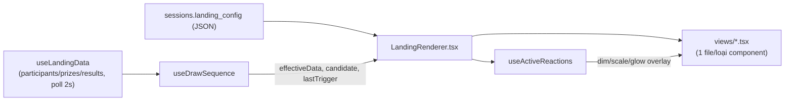

# Present Mode vs Builder canvas

## Pipeline render

`LandingRenderer` là **painter thuần** — không state, không tương tác — dùng lại y nguyên bởi
`LandingCanvas` (Builder, `interactive` mặc định `false`) và `PresentMode.tsx` (`interactive=true`),
đảm bảo 2 nơi không bao giờ vẽ lệch nhau.

## Khác biệt theo prop `interactive`

Cả 2 dùng chung `LandingRenderer.tsx`, khác nhau ở prop `interactive`:

- **`interactive=true`** (chỉ Present Mode): `sequence` thật (không phải `undefined`) được truyền
  xuống — Button mới bấm được, action mới chạy thật (xem [button-actions.md](./button-actions.md));
  `hiddenInBuilder` bị phớt lờ (khán giả luôn thấy đúng những gì config khai báo); Scoreboard vẽ như
  1 modal riêng canh giữa màn hình, chỉ hiện khi `sequence.scoreboardVisible`.
- **`interactive=false`** (Builder canvas): `sequence` là `undefined` → Button tự disable (không
  bấm được, tránh chạy quay số thật lúc đang chỉnh sửa) — Scoreboard vẽ tại chỗ theo x/y như mọi
  component khác (để còn kéo/resize được). Lucky Wheel vẫn tự dò `results[0].id` như ở Present Mode,
  nhưng Builder không truyền `data` thật xuống Canvas nên trong thực tế nó luôn đứng yên ở đó.

Đây cũng là ranh giới bắt buộc phải tôn trọng khi thêm 1 effect/component mới có animation thật —
xem quy tắc chi tiết ở [effects.md](./effects.md) mục 2 (`interactive=false` LUÔN hiện khung tĩnh,
không chạy animation loop thật).

## Cảnh báo "Column not found" — chỉ ở Builder canvas

`availableParticipantColumns(participants)` (`src/lib/landing/types.ts`) tính tập cột Participant
THỰC SỰ còn tồn tại (4 field cố định + hợp nhất mọi key `extra_data` đang dùng);
`missingColumnBindings(component, available)` đối chiếu 3 chỗ hay bind 1 cột optional cụ thể — Lucky
Wheel (`drawField`/`displayField`/`winnerDisplayField`), Scoreboard (`columns`), Button action
`openLink` (`urlField`) — trả về danh sách cột không còn tồn tại (đã bị xoá ở Data Editor, xem
[participants/data-editor.md](../participants/data-editor.md)).

`LandingRenderer.tsx` chỉ tính + hiện badge đỏ "⚠ Column not found: x" này khi `builderPreview`
(canvas Builder) — KHÔNG hiện ở Present Mode thật, để không làm rối buổi quay đang chạy.

**Bug đã sửa: Scoreboard luôn báo oan "Column not found" cho 6 field mặc định** — `Scoreboard.columns`
trộn lẫn 2 hệ tên khác hẳn nhau: 6 field CỐ ĐỊNH (`SCOREBOARD_FIELDS` — `participantName`/
`participantCode`/`participantPhone`/`participantEmail`/`prizeName`/`prizeCategory`) không phải tên
cột Participant thật, mà là khoá resolve THẲNG từ `DrawResultRow`/`Prize` (xem `valueOf` trong
`TableTemplate.tsx` — vd `participantName` → `r.participant_name`, `prizeCategory` → tra
`data.prizes`), và cột optional (`extra_data`) người dùng tự thêm SAU 6 field đó. `missingColumnBindings`
trước đây đối chiếu CẢ 6 field cố định này với `availableParticipantColumns` (tập tên cột Participant
thật) — sai hoàn toàn vì 2 hệ tên không bao giờ trùng nhau (`"participantName"` không phải
`"name"`), khiến MỌI Scoreboard bật cột mặc định (kể cả session dữ liệu hoàn toàn bình thường) đều bị
báo đỏ oan. Sửa bằng cách loại 6 field trong `SCOREBOARD_FIELDS` khỏi việc kiểm tra tồn tại — chỉ còn
cột optional thật sự cần đối chiếu.

## Bug đã sửa: mở lại 1 phiên đã quay dở thì tự nhảy hiện winner cũ

Mở Present Mode/`LandingPage.tsx` cho 1 session đã có `draw_results` từ trước: `effectiveData` lúc
CHƯA có `candidate` (`useDrawSequence.ts`) trả thẳng `data` — `data.results` lúc đó là **toàn bộ lịch
sử từ DB**, không phải "kết quả mới". Mọi component tự-quay/tự-hiện lại chỉ nhìn `results[0]?.id` để
quyết định "có nên chạy hay không" nên hiểu nhầm dòng lịch sử cũ là 1 kết quả mới: Digit Roller/Wheel
tự quay, Winner Name tự hiện tên, nền tự dim — vài giây sau khi mount, dù chưa ai bấm Draw.

Sửa bằng `isLiveDrawResultId(id)` = `id?.startsWith("pending-")` (hằng `PENDING_RESULT_ID_PREFIX`
trong `src/lib/landing/types.ts`) — chỉ dòng LIVE (đang có 1 lượt Draw thật trong phiên Present hiện
tại, id do `effectiveData` độn vào) mới coi là "có kết quả để phản ứng". Áp dụng ở
`WheelTemplate`/`DigitRollerTemplate` (điều kiện bắt đầu quay), `WinnerNameView`/`TextView` (feed
`useRevealed` một id LIVE-only, id khác thì luôn `undefined` = Idle), `BackgroundDimOverlay` (điều
kiện dim), và `LandingRenderer` (remount-on-result key = id LIVE hoặc `"idle"`). Kết quả: mở
Landing/Present luôn về màn hình Idle; ai muốn xem lịch sử trúng thưởng thì mở Scoreboard.

**Quyết định sản phẩm liên quan (đừng làm lại)**: KHÔNG xây tính năng "khôi phục winner gần nhất khi
mở lại 1 phiên" — dù kỹ thuật khả thi (winner đã Confirm nằm sẵn trong `draw_results`), đã cân nhắc
và từ chối vì Scoreboard đã đủ để xem lại lịch sử trúng thưởng.

## Winner Name / Text (syncWithDraw) — 3 trạng thái Idle/Revealed/Disappear

`useRevealed` (`drawRevealHooks.ts`, dùng chung bởi `WinnerNameView.tsx` và `TextView.tsx` khi
`syncWithDraw`) luôn ở đúng 1 trong 3 trạng thái, **hoàn toàn tự quản lý qua 2 field của CHÍNH
component đó** (`appearDelayMs`/`disappearDelayMs`, đặt ở Properties Panel — xem
`WinnerNameProps`/`TextProps` trong `types.ts`), KHÔNG còn phụ thuộc thời lượng quay của Lucky Wheel
trên trang (model cũ dùng `computeWheelRevealDelayMs` đã bỏ hẳn — công thức đó không tính đúng tuyệt
đối cho mọi hiệu ứng quay, đặc biệt Reel/Flicker của Digit Roller):

1. **Idle** (chưa Draw lần nào / vừa Reset): không hiện gì, không delay nào áp dụng.
2. **Draw lần đầu**: giữ "" cho tới đúng `appearDelayMs` tính từ lúc bấm Draw (`resultId` đổi), rồi
   `appearEffect` chạy để hiện tên/nội dung.
3. **Draw lần tiếp theo** (đang hiện của lượt trước): chuỗi CŨ đứng yên tại chỗ cho tới đúng
   `disappearDelayMs` (tính từ CÙNG mốc bấm Draw) thì `disappearEffect` mới chạy để nó biến mất —
   ĐỘC LẬP, không xếp hàng chờ, chuỗi MỚI cũng hiện sau đúng `appearDelayMs` tính từ mốc đó.

`value` (winnerName/content) chỉ được đọc vào ĐÚNG lúc mỗi timer chạy (qua closure của effect) —
không hiện ngay dù giá trị nguồn đã đổi tức thì lúc bấm Draw, tránh bug "tên MỚI nhảy vào chỗ tên CŨ"
trước khi Disappear kịp chạy (bản chất chính là bug "flash tên mới khi Redraw" đã từng gặp ở bản cũ,
nay được giải quyết TRIỆT ĐỂ hơn — không chỉ reset `revealed` trong render mà còn tách hẳn timing
Appear/Disappear thành 2 field độc lập).

**Reset ép về Idle NGAY LẬP TỨC, không suy luận qua `resultId`**: `DrawSequenceActions.resetSeq`
(`useDrawSequence.ts`) tăng thêm 1 mỗi lần `resetSession()` chạy xong thật sự — `useRevealed` đổi giá
trị này thì ép `displayed` về `""` NGAY trong render + huỷ mọi timer Appear/Disappear đang chờ, KHÔNG
đợi `results[0].id` đổi (vốn phải chờ đúng nhịp `data` refresh xong, dễ lệch nhịp nếu 1 request
refresh CŨ hơn lại resolve SAU — xem `useLandingData.ts`). Tín hiệu tường minh này bảo đảm Winner
Name/Text luôn về đúng trạng thái mới-vào-landing sau Reset, bất kể đang Idle/Revealed/Disappear lúc
bấm.

Properties Panel của Winner Name (`LiveTextPanel.tsx`) tổ chức 2 mục "When Revealed"/"When Disappear"
— mỗi mục CHỈ gồm đúng **Effect** + **Delay (ms)** — xem thêm
[properties-panel.md](./properties-panel.md).
