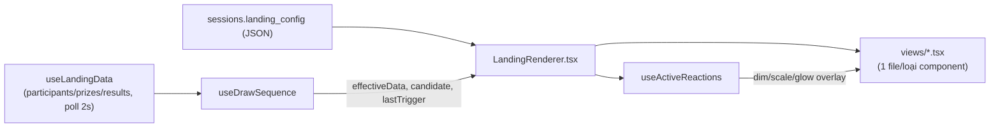

# Present Mode vs Builder canvas

## Pipeline render

`LandingRenderer` là **painter thuần** — không state, không tương tác — dùng lại y nguyên bởi
`LandingCanvas` (Builder, `interactive` mặc định `false`) và `PresentMode.tsx` (`interactive=true`),
đảm bảo 2 nơi không bao giờ vẽ lệch nhau.

## Khác biệt theo prop `interactive`

Cả 2 dùng chung `LandingRenderer.tsx`, khác nhau ở prop `interactive`:

- **`interactive=true`** (chỉ Present Mode): `sequence` thật (không phải `undefined`) được truyền
  xuống — Button mới bấm được, action mới chạy thật (xem [button-actions.md](./button-actions.md));
  `hiddenInBuilder` bị phớt lờ (khán giả luôn thấy đúng những gì config khai báo); Scoreboard vẽ như
  1 modal riêng canh giữa màn hình, chỉ hiện khi `sequence.scoreboardVisible`.
- **`interactive=false`** (Builder canvas): `sequence` là `undefined` → Button tự disable (không
  bấm được, tránh chạy quay số thật lúc đang chỉnh sửa) — Scoreboard vẽ tại chỗ theo x/y như mọi
  component khác (để còn kéo/resize được). Lucky Wheel vẫn tự dò `results[0].id` như ở Present Mode,
  nhưng Builder không truyền `data` thật xuống Canvas nên trong thực tế nó luôn đứng yên ở đó.

Đây cũng là ranh giới bắt buộc phải tôn trọng khi thêm 1 effect/component mới có animation thật —
xem quy tắc chi tiết ở [effects.md](./effects.md) mục 2 (`interactive=false` LUÔN hiện khung tĩnh,
không chạy animation loop thật).

## Cảnh báo "Column not found" — chỉ ở Builder canvas

`availableParticipantColumns(participants)` (`src/lib/landing/types.ts`) tính tập cột Participant
THỰC SỰ còn tồn tại (4 field cố định + hợp nhất mọi key `extra_data` đang dùng);
`missingColumnBindings(component, available)` đối chiếu 3 chỗ hay bind 1 cột optional cụ thể — Lucky
Wheel (`drawField`/`displayField`/`winnerDisplayField`), Scoreboard (`columns`), Button action
`openLink` (`urlField`) — trả về danh sách cột không còn tồn tại (đã bị xoá ở Data Editor, xem
[participants/data-editor.md](../participants/data-editor.md)).

`LandingRenderer.tsx` chỉ tính + hiện badge đỏ "⚠ Column not found: x" này khi `builderPreview`
(canvas Builder) — KHÔNG hiện ở Present Mode thật, để không làm rối buổi quay đang chạy.

## Bug đã sửa: mở lại 1 phiên đã quay dở thì tự nhảy hiện winner cũ

Mở Present Mode/`LandingPage.tsx` cho 1 session đã có `draw_results` từ trước: `effectiveData` lúc
CHƯA có `candidate` (`useDrawSequence.ts`) trả thẳng `data` — `data.results` lúc đó là **toàn bộ lịch
sử từ DB**, không phải "kết quả mới". Mọi component tự-quay/tự-hiện lại chỉ nhìn `results[0]?.id` để
quyết định "có nên chạy hay không" nên hiểu nhầm dòng lịch sử cũ là 1 kết quả mới: Digit Roller/Wheel
tự quay, Winner Name tự hiện tên, nền tự dim — vài giây sau khi mount, dù chưa ai bấm Draw.

Sửa bằng `isLiveDrawResultId(id)` = `id?.startsWith("pending-")` (hằng `PENDING_RESULT_ID_PREFIX`
trong `src/lib/landing/types.ts`) — chỉ dòng LIVE (đang có 1 lượt Draw thật trong phiên Present hiện
tại, id do `effectiveData` độn vào) mới coi là "có kết quả để phản ứng". Áp dụng ở
`WheelTemplate`/`DigitRollerTemplate` (điều kiện bắt đầu quay), `WinnerNameView`/`TextView` (feed
`useRevealed` một id LIVE-only, id khác thì luôn `undefined` = Idle), `BackgroundDimOverlay` (điều
kiện dim), và `LandingRenderer` (remount-on-result key = id LIVE hoặc `"idle"`). Kết quả: mở
Landing/Present luôn về màn hình Idle; ai muốn xem lịch sử trúng thưởng thì mở Scoreboard.

**Quyết định sản phẩm liên quan (đừng làm lại)**: KHÔNG xây tính năng "khôi phục winner gần nhất khi
mở lại 1 phiên" — dù kỹ thuật khả thi (winner đã Confirm nằm sẵn trong `draw_results`), đã cân nhắc
và từ chối vì Scoreboard đã đủ để xem lại lịch sử trúng thưởng.

## Bug đã sửa: Winner Name flash tên người trúng MỚI khi Redraw

Bấm Draw lại lúc đang có 1 candidate chờ Confirm (`redo()`, single-draw): `setCandidate(next)` đổi
`results[0]` sang candidate mới NGAY LẬP TỨC, nhưng `useRevealed` (`drawRevealHooks.ts`) trước đây
chỉ đặt lại `revealed = false` trong 1 `useEffect` — tức là SAU render + paint. Có đúng 1 khung hình
`revealed` vẫn `true` (từ lượt trước) trong khi `results[0].participant_name` đã là tên MỚI →
`useRevealTransition` chạy appear animation lộ tên người trúng mới ra trước khi Wheel kịp quay.

Sửa bằng cách reset `revealed` **trong lúc render** khi `resultId` đổi (setState-trong-render có
điều kiện, so khác giá trị qua 1 `ref` — pattern React chính thức cho "điều chỉnh state khi 1 prop
đổi"): React huỷ ngay output của render đang lộ tên mới và render lại trước khi paint, nên khung hình
đó không bao giờ hiển thị ra màn hình.
