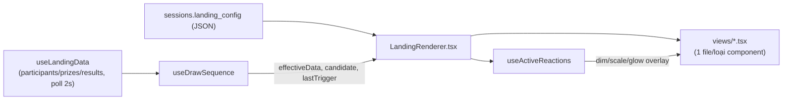

# Present Mode vs Builder canvas

## Pipeline render

`LandingRenderer` là **painter thuần** — không state, không tương tác — dùng lại y nguyên bởi
`LandingCanvas` (Builder, `interactive` mặc định `false`) và `PresentMode.tsx` (`interactive=true`),
đảm bảo 2 nơi không bao giờ vẽ lệch nhau.

## Khác biệt theo prop `interactive`

Cả 2 dùng chung `LandingRenderer.tsx`, khác nhau ở prop `interactive`:

- **`interactive=true`** (chỉ Present Mode): `sequence` thật (không phải `undefined`) được truyền
  xuống — Button mới bấm được, action mới chạy thật (xem [button-actions.md](./button-actions.md));
  `hiddenInBuilder` bị phớt lờ (khán giả luôn thấy đúng những gì config khai báo); Scoreboard vẽ như
  1 modal riêng canh giữa màn hình, chỉ hiện khi `sequence.scoreboardVisible`.
- **`interactive=false`** (Builder canvas): `sequence` là `undefined` → Button tự disable (không
  bấm được, tránh chạy quay số thật lúc đang chỉnh sửa) — Scoreboard vẽ tại chỗ theo x/y như mọi
  component khác (để còn kéo/resize được). Lucky Wheel vẫn tự dò `results[0].id` như ở Present Mode,
  nhưng Builder không truyền `data` thật xuống Canvas nên trong thực tế nó luôn đứng yên ở đó.

Đây cũng là ranh giới bắt buộc phải tôn trọng khi thêm 1 effect/component mới có animation thật —
xem quy tắc chi tiết ở [effects.md](./effects.md) mục 2 (`interactive=false` LUÔN hiện khung tĩnh,
không chạy animation loop thật).
