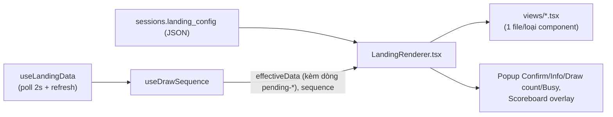

# Presentation — Present Mode, màn hình chiếu cho khán giả

Đọc trước khi sửa `src/pages/PresentMode.tsx`, `src/components/landing/LandingRenderer.tsx`,
`useDrawSequence.ts`, `useLandingData.ts`, `views/drawRevealHooks.ts`, hoặc bất kỳ `views/*` nào có
animation. Cửa sổ dựng trang: [builder.md](./builder.md). Từng loại component:
1 file `<component>.md` cùng thư mục (bảng ở [builder.md mục 5](./builder.md#5-add-component--danh-sách-component)).

## 1. Cửa sổ Present Mode

- **Mở**: nút **Presentation** ở tab Landing Page của cửa sổ chính (`LandingPage.tsx`) → route
  `#/present/:sessionId`. Mở **windowed** để người vận hành kéo sang màn hình 2 trước, rồi tự bấm
  fullscreen bằng nút mờ góc phải trên (sáng lên khi hover) hoặc **F11**. Trạng thái fullscreen đồng
  bộ 2 chiều qua `present:fullscreen-changed` (kể cả khi đổi bằng cách khác, vd nút xanh lá macOS).
  Chi tiết cửa sổ: [`docs/architecture/ipc-and-windows.md`](../architecture/ipc-and-windows.md).
- **Scale & letterbox**: artboard 1920×1080 luôn scale vừa cửa sổ, giữ 16:9
  (`min(innerWidth/1920, innerHeight/1080)`), phần dư tô đen.
- **Frame** (Output Frame): component khung vùng LED cắt chỉ vẽ ở đây khi bật "Show in Presentation" —
  xem [`output-frame.md`](output-frame.md).
- **Tự cập nhật khi Builder Save**: poll `sessions.get` mỗi **2s** → parse `landing_config` + lọc type
  không còn tồn tại. Không cần đóng/mở lại khi sửa trang.
- **Dữ liệu sống**: `useLandingData` — nguồn fetch/poll DUY NHẤT cho participants/prizes/results/
  `participant_column_types`, poll **2s**, kèm `refresh()` gọi ngay sau Confirm/Reset (mục 3).

## 2. Pipeline render — Builder, preview, Present Mode

`LandingRenderer` là **painter thuần** (không state), dùng chung ở 3 nơi, khác nhau qua 2 tín hiệu:

| | `interactive` | `clip` (→ `builderPreview = clip === false`) | Hệ quả |
|---|---|---|---|
| Canvas Builder (`LandingCanvas`) | `false` | `false` | Component tĩnh LUÔN hiện (bỏ qua Trigger with Draw) để còn chọn/kéo; animation không chạy (khung tĩnh); `hiddenInBuilder` có hiệu lực; badge cảnh báo; Scoreboard vẽ tại chỗ; Button không bấm được |
| Preview cửa sổ chính (`LandingPage.tsx`) | `false` | `true` | Hiện đúng trạng thái ẩn/hiện thật như Present Mode nhưng không có `sequence` (không bấm được, không animation) |
| **Present Mode** | `true` | `true` | `sequence` thật được truyền xuống — Button/Prize bấm được, animation chạy, popup hoạt động; Scoreboard thành popup giữa màn hình |

**Quy tắc bắt buộc cho component có animation**: `interactive=false` LUÔN vẽ khung tĩnh (Canvas: 1
khung / mô phỏng trước bằng seed cố định; CSS: không chạy loop), chỉ `interactive=true` mới chạy
animation thật — tránh giật/phân tâm khi đang kéo-thả nhiều component.

**Click xuyên khung**: mỗi component bọc trong 1 wrapper `pointerEvents: "none"` (khung kéo-thả thường
to hơn nội dung thật — từng gặp Wheel đè lên nuốt click của Button). Chỉ phần tử thật sự cần bắt click
tự bật lại `pointer-events: auto`: Button, Prize (qua bộ hit-test riêng), Scoreboard popup, các popup.
Nhờ vậy Effect phủ cả màn hình không chặn click bên dưới.

**Hiệu ứng xuất hiện** (`component.effect`, class `landing-effect-*`): chạy 1 lần lúc wrapper mount.
Riêng `prizeImage` nằm trong `REMOUNT_ON_RESULT_TYPES` — wrapper remount (entrance bắn lại) mỗi khi có
kết quả LIVE mới. Lucky Wheel và Winner KHÔNG remount (tự quản lý animation; remount sẽ mất góc quay /
huỷ mất lớp tên cũ trước khi kịp chạy hiệu ứng Disappear).

## 3. Luồng quay — `useDrawSequence.ts`

Cầu nối DUY NHẤT từ Landing sang Draw Engine (thuật toán: [`docs/architecture/draw-engine.md`](../architecture/draw-engine.md)).
Trả về `DrawSequenceActions` (shape khai báo ở `types.ts`) + `effectiveData`.

| Hàm | Làm gì |
|---|---|
| `pick()` | `draw:pick` → có `candidate` (chưa Confirm). DB chỉ ghi 1 dòng lịch sử `confirmed = 0` |
| `confirm()` | `draw:commit` → `confirmed = 1` + trừ `prizes.remaining` (ghi DB thật), rồi `refresh()` |
| `redo()` | Bỏ candidate đang chờ, pick người khác cho ĐÚNG giải đó (loại trừ người vừa bị bỏ) |
| `resetSession()` | Xoá `draw_results` của session, trả `remaining` về gốc, xoá candidate, tăng `resetSeq`, `refresh()` |
| `runDraw()` / `selectDrawMode()` | Nút Draw chính và 3 chế độ Single/Multiple/Quick — xem [components/button.md](./button.md) |

- **`effectiveData`**: khi có `candidate`, độn 1 dòng giả `id = "pending-<seed>"` vào ĐẦU `results`
  (tên/phone/code/email resolve theo Data Type). Mọi component thấy "có kết quả" NGAY khi Draw chạy,
  trước khi Confirm. Nếu không bao giờ Confirm, người đó hiện trên màn hình nhưng không tồn tại trong
  kết quả đã xác nhận. Scoreboard lọc bỏ các dòng `pending-*`.
- **Chỉ kết quả LIVE mới kích hoạt**: `isLiveDrawResultId(id)` = `id` bắt đầu bằng `pending-`
  (`PENDING_RESULT_ID_PREFIX`). Wheel/Digit Roller/Winner/Text/Image/Background/Effects/remount entrance
  chỉ phản ứng với dòng này.
  **Bug đã sửa**: trước đây mở lại 1 phiên đã quay dở thì `results[0]` là lịch sử từ DB → Wheel tự
  quay, Winner tự hiện tên dù chưa ai bấm Draw. **Quyết định sản phẩm (đừng làm lại)**: Landing/Present
  luôn mở ở Idle, KHÔNG khôi phục winner gần nhất — muốn xem lịch sử thì mở Scoreboard.
- **`spinning`** — khoá gần như MỌI thao tác (Button nào cũng no-op, không đổi giải đang chọn được) từ
  lúc có candidate mới tới khi Lucky Wheel quay xong hẳn: thời lượng = `computeWheelRevealDelayMs()`
  (lấy cận trên nếu Digit Roller dừng lần lượt), tính ở `PresentMode.tsx`. Trang không có Lucky Wheel
  → gần như không khoá. Multiple/Quick Draw giữ `spinning = true` suốt cả batch.
- **Bắt buộc chọn giải**: trang có Prize Image (`hasSelectablePrizeUI`) thì `pick()` và `redo()` đều
  đòi `selectedPrizeId` (không có → popup "Please select a prize first!"). Trang không có Prize Image
  thì Draw Engine tự random có trọng số trên các giải còn hàng. Giải đang chọn vừa hết hàng thì tự bỏ
  chọn sau khi quay xong, không kèm popup.
- **`resetSeq`**: tăng 1 mỗi lần Reset chạy xong thật — tín hiệu tường minh để Winner/Text/Image/
  Background/Effects về Idle ngay, không suy luận qua `results[0].id`.
- **IPC timeout 10s** (`withTimeout`) — tránh treo vô hạn khi main process không trả lời.
- **Lỗi nghiệp vụ hiện như thông báo, không như crash**: Electron bọc lỗi từ main thành
  `Error invoking remote method 'draw:pick': Error: …`; `cleanErrorMessage()` bóc lớp bọc, hiện câu gốc
  qua popup Info (trước đây là 1 thanh chữ đỏ ở đáy màn hình, trông như lỗi code — đã bỏ).

## 4. Interactions with Draw — model Idle/Draw/Redraw

Dùng chung cho **8 component "tĩnh"** (nội dung do người dùng đặt, không đổi theo từng lượt): Text,
Image, Background và 5 Effect. Winner KHÔNG dùng model này (tên người trúng đổi theo từng lượt — có
cơ chế riêng, xem [components/winner.md](./winner.md)).

- **Panel**: `DrawCycleFields.tsx` — checkbox **Trigger with Draw** (`syncWithDraw`, tắt = component
  luôn hiện như bình thường), dropdown **Prize**, rồi 3 mốc **Idle / Draw / Redraw**, mỗi mốc 1
  dropdown **Appearance** + **Effect** + **Delay (ms)** (+ **Amount** khi Appearance là Dim/Blur).
- **Hook**: `useDrawCycleVisibility(resultId, drawCycle, resetSeq)` trong `drawRevealHooks.ts` →
  `shown`, `transitionClass`, `activeState`, `activeAmount`. View PHẢI lấy `resultId` qua
  `drawCycleResultId(latest, drawCycle)`, không tự đọc `isLiveDrawResultId`.

### 3 mốc

| Mốc | Khi nào | Field |
|---|---|---|
| **Idle** | Vừa vào Landing / vừa Reset / lượt vừa quay ra giải khác giải đã gán | `idleState` (bắt buộc có giá trị, không có None) + `idleEffect` |
| **Draw** | 1 lượt Draw mới khi đang ở Idle | `drawAction` (None hoặc khác Idle) + `drawEffect` |
| **Redraw** | 1 lượt Draw mới khi đang hiện kết quả lượt trước | `redrawAction` (None hoặc khác mốc thật gần nhất phía trước) + `redrawEffect` |

**Appearance** (`DrawRestState`): `appear` / `disappear` / `dim` / `blur` — 4 giá trị ngang hàng, mỗi
component khai báo domain riêng qua prop `allowedStates`:
- Text: chỉ Appear/Disappear.
- Image, Background: đủ 4 (Dim % mặc định 80, Blur px mặc định 16). Image vẽ dim/blur bằng CSS filter
  thẳng lên `` (giữ vùng PNG trong suốt), Background bằng lớp phủ đen + filter blur.
- 5 Effect: Appear/Disappear (ẩn = unmount canvas, dừng luôn rAF; hiện lại thì chạy lại từ đầu).

**Ràng buộc** (không chọn sai được): Draw bị vô hiệu hoá đúng lựa chọn TRÙNG Idle; Redraw bị vô hiệu
hoá lựa chọn TRÙNG Draw (nếu Draw ≠ None, ngược lại trùng Idle). Đổi Idle làm Draw/Redraw đang lưu
không còn hợp lệ thì panel tự sửa: domain 2 giá trị còn đúng 1 lựa chọn → tự chọn; domain rộng hơn →
reset về None. Với domain 2 giá trị, quy tắc này cho ra đúng luân phiên nhị phân.

**Bật Trigger with Draw lần đầu** tự nạp `idle = disappear`, `draw = appear`, `redraw = disappear` +
effect crossfade — "ẩn lúc Idle, hiện lúc Draw, ẩn rồi hiện lại lúc Redraw" — bật lên là thấy tác dụng.

### Thời điểm

- **Idle**: hiệu ứng `idleEffect` chỉ chạy khi QUAY VỀ Idle (Reset / đổi giải). Lúc trang vừa mở,
  `idleState` chỉ quyết định dáng vẻ tĩnh ban đầu, không có animation.
- **Draw**: sau `drawEffect.delayMs` kể từ lúc bấm Draw, chạy `drawEffect` sang `drawAction`.
- **Redraw** — CHUỖI tuần tự: sau `redrawEffect.delayMs` chạy `redrawEffect` sang `redrawAction`; khi
  bước đó xong HẲN (`onDone`), chờ thêm **1s cố định** (`MIN_REDRAW_REVEAL_GAP_MS`, không cấu hình
  được), rồi sau `drawEffect.delayMs` tự chạy lại bằng CHÍNH `drawEffect` để về trạng thái của Draw (nếu
  Draw ≠ None). Không có field riêng cho bước "đổi lại" — công bố kết quả là 1 hành động dù Draw đầu hay
  Redraw. Khoảng "ẩn xong → hiện lại" luôn = `1000 + drawEffect.delayMs`.
  **Bug đã sửa**: bản trước bọc `setTimeout(drawEffect.delayMs)` bên ngoài `runStep` trong khi `runStep`
  đã tự áp delay đó → trễ bị áp 2 lần; và từng đo 2 mốc song song cùng gốc khiến nội dung mới hiện đè
  lên lúc cũ còn đang ẩn dở.

### Lọc theo Prize

Dropdown **Prize**: "Any prize" (mặc định) hoặc 1 giải cụ thể (hiện "Category - Tên giải"). Gán giải
thì chỉ lượt quay ra ĐÚNG giải đó mới chạy Draw/Redraw; lượt ra giải khác → `drawCycleResultId()` trả
`undefined` → component về **Idle** (chạy `idleEffect` như Reset); lượt đúng giải kế tiếp tính là Draw
mới. Lọc theo giải ĐÃ QUAY RA (`results[0].prize_id`), không theo giải đang click chọn — đúng cả với
trang không có Prize Image. Danh sách giải đưa xuống panel qua `DrawCyclePrizesContext`. Giải đã gán bị
xoá: dropdown hiện "(Deleted prize)", canvas Builder gắn badge "⚠ Prize not found".

Ví dụ Podium (Image, Idle = Appear): hiện sẵn lúc đứng yên, Draw = Disappear (ẩn khi bắt đầu quay),
Redraw = Disappear rồi tự hiện lại bằng Effect của Draw.

## 5. Popup & lớp phủ (chỉ Present Mode)

Vẽ trong `LandingRenderer.tsx` (cần phủ toàn bộ canvas đã scale, 1 component riêng lẻ không có toạ
độ đó):

| Popup | Khi nào | Đóng |
|---|---|---|
| **Scoreboard** | `sequence.scoreboardVisible` (Button Scoreboard) — canh giữa, kích thước = width/height đã kéo ở Builder, nền tối | Nút ✕, Esc (trừ khi đang có popup Confirm nổi trên) |
| **Confirm** (`confirmPrompt`, z-50) | Button Confirm/Reset, hoặc Draw khi còn candidate chưa Confirm | Cancel / click nền / Esc. `holdMs` (Reset: 3s) đổi nút thành giữ-để-xác-nhận (`HoldToConfirmButton.tsx`) |
| **Draw count** (`drawModePrompt`) | Chọn Multiple/Quick Draw | `DrawModeCountPopup.tsx` — nhập số ≤ remaining |
| **Info** (`infoPrompt`, z-50) | Thông báo nghiệp vụ: chưa chọn giải, giải hết hàng, chưa có winner, lỗi Draw/Confirm… | Chỉ nút OK / click nền / Esc |
| **Busy** (z-60) | `sequence.busy` — Confirm/Reset đang ghi DB, GỒM cả bước `refresh()` sau đó | Không đóng được; chặn mọi click cho tới khi dữ liệu đã mới (bug đã sửa: Reset xong chọn giải ngay bị báo "hết hàng" sai) |

`EscapeKeyHandler.tsx` gắn Esc cho từng popup; khi 2 popup chồng nhau chỉ popup trên cùng nhận Esc.

## 6. File liên quan

| File | Vai trò |
|---|---|
| `src/pages/PresentMode.tsx` | Cửa sổ chiếu — poll config 2s, scale/letterbox, nút fullscreen, gọi `useDrawSequence` |
| `src/pages/LandingPage.tsx` | Preview read-only ở cửa sổ chính, nút mở Builder/Presentation |
| `src/components/landing/LandingRenderer.tsx` | Painter dùng chung, popup, `REMOUNT_ON_RESULT_TYPES` |
| `src/components/landing/useLandingData.ts` | Fetch/poll dữ liệu sống (2s) + `refresh()` |
| `src/components/landing/useDrawSequence.ts` | Luồng pick/confirm/redo/reset, chế độ Draw, popup state, `effectiveData` |
| `src/components/landing/views/drawRevealHooks.ts` | `useDrawCycleVisibility` (mục 4), `useRevealed`/`useRevealTransition` (Winner) |
| `src/components/landing/panels/DrawCycleFields.tsx` | Panel "Interactions with Draw" dùng chung |
| `src/components/landing/views/HoldToConfirmButton.tsx`, `DrawModeCountPopup.tsx`, `EscapeKeyHandler.tsx` | Popup |
| `electron/main.ts` | `openPresentWindow`, fullscreen/F11, IPC `draw:*`, `sessions:results` |
