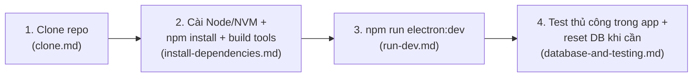

# Local Setup for Lucky Draw Studio

App desktop Electron + React + SQLite, chạy hoàn toàn offline. Thư mục này hướng dẫn từ lúc kéo code
về máy tới lúc chạy được `npm run electron:dev` và biết cách kiểm tra thay đổi trước khi commit, tách
theo từng bước để không phải đọc lại toàn bộ mỗi lần chỉ cần tra 1 phần:

| File | Nội dung |
|---|---|
| [clone.md](./clone.md) | Cài Git, kéo code về máy |
| [install-dependencies.md](./install-dependencies.md) | Node.js (qua NVM), `npm install`, Python 3.11, Native Build Tools — điều kiện để build được native module `better-sqlite3` |
| [run-dev.md](./run-dev.md) | Chạy `npm run electron:dev`, các lỗi thường gặp lúc dev (port bận, `ELECTRON_RUN_AS_NODE`, sửa `electron/` phải khởi động lại) |
| [database-and-testing.md](./database-and-testing.md) | Vị trí file SQLite theo từng OS, cách reset dữ liệu để test lại từ đầu, kiểm tra thay đổi trước khi commit (chưa có test suite tự động) |
| [platform-differences.md](./platform-differences.md) | Bảng tra nhanh MỌI khác biệt Windows/macOS/Linux xuyên suốt toàn bộ quá trình — dùng khi chỉ cần tra 1 lệnh cho đúng OS |

## Quy trình tổng quát

Chỉ cần làm lại bước 2 (`install-dependencies.md`) khi: đổi máy, đổi version Node.js, hoặc gặp lỗi
`NODE_MODULE_VERSION mismatch` sau khi `npm install`/đổi Electron version — không cần làm lại mỗi lần
code thay đổi. Sửa file trong `electron/` luôn cần khởi động lại `npm run electron:dev` (không
hot-reload) — xem [run-dev.md](./run-dev.md).

## Tham khảo thêm

- [`../architecture/`](../architecture/README.md) — kiến trúc code (IPC 3 lớp, schema DB, Draw
  Engine, multi-window...), đọc SAU KHI đã chạy được app.
- [`../deploy/`](../deploy/README.md) — build bản production (`npm run package`) và checklist trước
  khi phát hành, khác với chạy dev ở đây.
