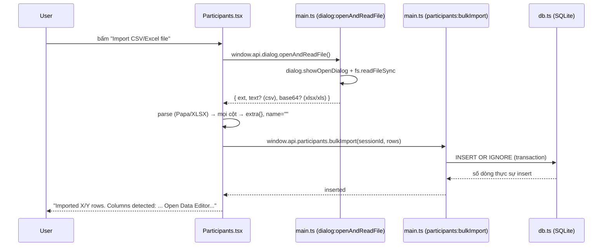

# Import participants (CSV/Excel)

## Quyết định thiết kế: import KHÔNG đoán cột

**Trước đây**: `Participants.tsx` có 1 `Set` các chuỗi cứng (`"name"`, `"Name"`, `"Họ tên"`, `"phone"`, `"SĐT"`...) và cố khớp header file với danh sách đó để tự điền vào core field `name`/`phone`/`code`/`email`. Cách này vỡ ở bất kỳ trường hợp nào:

- File Excel xuất CSV UTF-8 kèm BOM (``) ở đầu file → cột đầu tiên thành `"Name"`, không khớp `"Name"`.
- Header có khoảng trắng thừa, viết hoa/thường khác, hoặc dùng biến thể chưa liệt kê (`"Full Name"`, `"Họ và tên"`...).
- `electron/main.ts` (`participants:bulkImport`) có `if (!row.name) continue` — hễ `name` rỗng là **bỏ luôn cả dòng**, không phải chỉ thiếu 1 field.

Hậu quả thực tế: người dùng import file 555 dòng, thấy `Imported 0/555 participants` mà không rõ vì sao — vì mọi dòng đều bị skip do `name` không khớp được cột nào.

**Bây giờ**: import **không đoán gì cả**. Tên cột trong file (dù là "Name", "Họ tên", "Ma khach hang", hay bất kỳ chuỗi nào) không có ý nghĩa gì với hệ thống — mọi cột đều được coi là dữ liệu generic, đẩy nguyên vào `extra_data`. Việc quyết định "cột nào là Name/Phone/Code/Email" chuyển thành 1 thao tác **thủ công, làm SAU khi import xong**, trong Data Editor — xem [column-mapping.md](./column-mapping.md).

## Luồng xử lý (`src/pages/Participants.tsx` → `handleImportFile`)



### Đọc file — vì sao không dùng `fetch("file://...")`

Renderer chạy dưới `contextIsolation: true` nên không tự đọc file được (xem quy tắc chung ở `CLAUDE.md`). Đọc file đi qua IPC: `dialog:openAndReadFile` (main.ts) dùng `dialog.showOpenDialog` + `fs.readFileSync`, trả về:

- CSV → `{ ext: "csv", text }` (đọc bằng `utf-8`, **giữ nguyên BOM nếu có** — `Buffer`/`fs` không tự strip).
- Excel (`.xlsx`/`.xls`) → `{ ext, base64 }` (renderer tự `atob()` + `XLSX.read` vì thư viện `xlsx` cần chạy trong renderer).

### Parse CSV — xử lý BOM

```ts
const text = result.text!.replace(/^/, "");
const parsed = Papa.parse(text, {
  header: true,
  skipEmptyLines: true,
  transformHeader: (h) => h.trim(),
});
```

Bỏ BOM thủ công trước khi parse — nếu không, PapaParse coi ký tự BOM là 1 phần tên cột đầu tiên, khiến tên cột hiển thị trong Data Editor có ký tự lạ ở đầu (dù không ảnh hưởng chức năng gán Data Type, vẫn nên tránh vì gây khó đọc).

### Chuẩn hoá dòng — generic, không phân loại

```ts
const normalized = rows
  .map((r) => {
    const extra: Record<string, string> = {};
    Object.keys(r).forEach((key) => {
      const value = r[key];
      if (value !== undefined && value !== null && String(value).trim() !== "") {
        extra[key.trim()] = String(value).trim();
      }
    });
    return { name: "", extra: Object.keys(extra).length ? extra : undefined };
  })
  .filter((r) => r.extra);
```

- `name` luôn là chuỗi rỗng lúc import — **không** còn cố gắng suy luận.
- Mọi cột (bất kể tên gì) → `extra`. Giá trị rỗng bị loại (không tạo key thừa trong JSON `extra_data`).
- Dòng nào tất cả các cột đều rỗng (dòng trắng thật sự trong file Excel) → bị `.filter()` loại bỏ trước khi gửi qua IPC.

### `participants:bulkImport` (`electron/main.ts`)

```ts
const hasAnyData =
  row.name || row.code || row.phone || row.email || (row.extra && Object.keys(row.extra).length > 0);
if (!hasAnyData) continue;
```

Điều kiện skip đổi từ "thiếu `name`" sang "**không có bất kỳ dữ liệu nào**" — vì `name` giờ luôn rỗng ở bước import, dùng điều kiện cũ sẽ lại bỏ hết 100% dòng như bug cũ. `INSERT OR IGNORE` vẫn giữ nguyên (tránh trùng `id` nếu import lại đúng dòng — thực tế hiếm gặp vì `id` là `randomUUID()` mới mỗi lần).

## Sau khi import xong

Message hiển thị cho người dùng liệt kê tên cột đã phát hiện được trong file và nhắc mở Data Editor để gán nhãn:

```
Imported 555/555 rows. Columns detected: Họ tên, SĐT, Email, Ghi chú.
Open Data Editor and set "Data type" on each column header to label Name/Phone/Code/Email.
```

Chưa gán Data Type nào cả thì Data Editor sẽ KHÔNG báo "Missing name"/"Missing phone" (chưa có gì để coi là thiếu) — chỉ khi người dùng gán 1 cột thành Data Type = Name/Phone, validate mới bắt đầu chạy đúng trên cột đó (xem [column-mapping.md](./column-mapping.md)).
