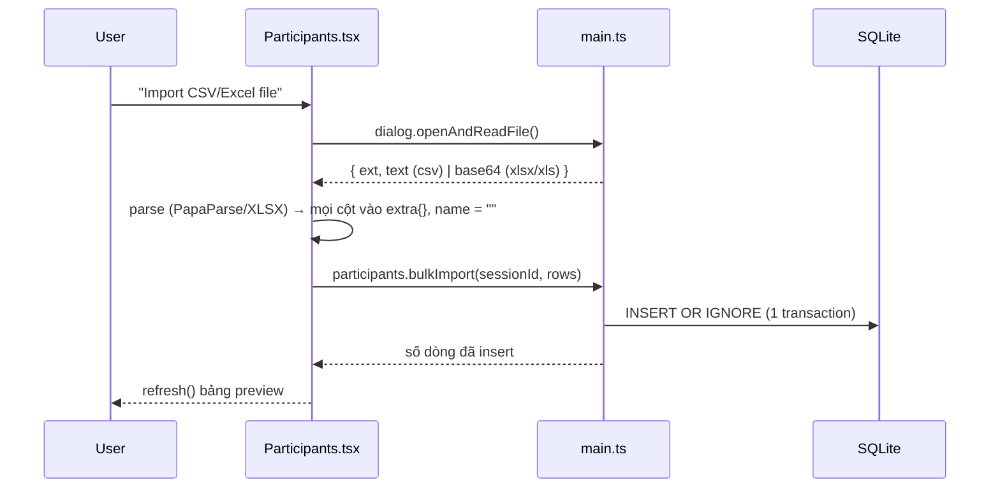

# Import participants (CSV/Excel)

Dữ liệu participant đi qua 3 giai đoạn: **Import** (file này) → **gán Data Type cho cột**
([column-mapping.md](./column-mapping.md)) → **quay số** (Draw Engine/Winner/Scoreboard đọc động theo
Data Type). Dọn dữ liệu giữa chừng: [data-editor.md](./data-editor.md). Cột DB: [schema.md](./schema.md).

## Quyết định thiết kế: import KHÔNG đoán cột

**Trước đây** `Participants.tsx` cố khớp header file với 1 danh sách chuỗi cứng (`"name"`, `"Họ tên"`,
`"SĐT"`…) để điền vào cột lõi `name`/`phone`/`code`/`email`, và `participants:bulkImport` bỏ qua mọi
dòng thiếu `name`. Vỡ ở mọi trường hợp lệch nhỏ: CSV UTF-8 có BOM (cột đầu thành `"Name"`), khoảng
trắng/hoa-thường khác, biến thể chưa liệt kê (`"Họ và tên"`, `"Full Name"`). Hậu quả thật: import file
555 dòng ra **"Imported 0/555 participants"** mà không rõ vì sao.

**Bây giờ** import **không đoán gì cả**: tên cột trong file không có ý nghĩa với hệ thống, mọi cột đưa
nguyên vào `extra_data`. "Cột nào là Name/Phone…" là thao tác thủ công SAU khi import, qua Data Type
trong Data Editor.

## Luồng xử lý (`Participants.tsx` → `handleImportFile`)

```mermaid
sequenceDiagram
  participant User
  participant R as Participants.tsx
  participant Main as main.ts
  participant DB as SQLite
  User->>R: "Import CSV/Excel file"
  R->>Main: dialog.openAndReadFile()
  Main-->>R: { ext, text (csv) | base64 (xlsx/xls) }
  R->>R: parse (PapaParse/XLSX) → mọi cột vào extra{}, name = ""
  R->>Main: participants.bulkImport(sessionId, rows)
  Main->>DB: INSERT OR IGNORE (1 transaction)
  Main-->>R: số dòng đã insert
  R-->>User: refresh() bảng preview
```

1. **Đọc file qua IPC** — renderer chạy `contextIsolation: true` nên không tự đọc file được
   (`fetch("file://…")` bị chặn, xem `CLAUDE.md`). `dialog:openAndReadFile` (main) dùng
   `dialog.showOpenDialog` + `fs.readFileSync`, trả CSV dạng `text` (utf-8, **giữ nguyên BOM**) hoặc
   Excel dạng `base64` (renderer tự `atob()` + `XLSX.read`).
2. **Parse CSV** — bỏ BOM thủ công trước (`text.replace(/^/, "")`), rồi
   `Papa.parse(text, { header: true, skipEmptyLines: true, transformHeader: h => h.trim() })`. Không bỏ
   BOM thì tên cột đầu có ký tự lạ.
3. **Chuẩn hoá dòng — generic**: mỗi dòng thành `{ name: "", extra }`, `extra` gồm mọi cột có giá trị
   (đã `trim`, ô rỗng không tạo key). Dòng mà mọi ô đều rỗng bị loại trước khi gửi qua IPC.
4. **`participants:bulkImport`** (main) — chỉ bỏ dòng **không có bất kỳ dữ liệu nào**
   (`name`/`code`/`phone`/`email` rỗng VÀ `extra` rỗng) — không còn bỏ dòng thiếu `name` (vì `name` giờ
   luôn rỗng). `INSERT OR IGNORE` trong 1 transaction, `id` = `randomUUID()`.

## Sau khi import

Chỉ `refresh()` bảng preview (header = tên cột gốc trong file) — không còn banner "Imported X/Y rows.
Columns detected: …" (quá dài, đã bỏ). Người dùng mở Data Editor để gán Data Type khi cần. Chưa gán Data
Type nào thì validate không báo "Missing Name"/"Missing Phone" — chưa có gì để coi là thiếu.

## Export

Nút **Export ▾** (`src/components/ExportMenu.tsx`) ở trang Participants và cạnh bảng Draw history ở
Dashboard — chọn Excel (`.xlsx`) hoặc CSV (`.csv`). Dùng chung `exportTable()` (`src/lib/exportTable.ts`):
renderer dựng nội dung bằng chính `papaparse` (`Papa.unparse`) / `xlsx` (`aoa_to_sheet`) của luồng
Import, rồi gọi IPC `dialog:saveFile` — main mở hộp thoại Save (mặc định thư mục Documents, tên file
`<session> - participants|draw history - <YYYY-MM-DD_HHMM>`) và ghi bằng `fs`. Lỗi ghi (vd file đang mở
trong Excel) báo bằng `alert`.

- **Participants**: đúng các cột của bảng preview (core field đang có dữ liệu + cột `extra_data` theo
  tên gốc), không có cột Source, không gồm dòng `removed`. Tên cột giữ nguyên → file xuất ra
  Import/Replace ngược lại được.
- **Draw history**: Time (giờ địa phương), Prize, các cột `imported_columns` (hoặc 1 cột Participant
  đã resolve nếu session chưa có `imported_columns`), Status — gồm cả lượt Not confirmed, mới nhất trước.
- CSV ghi kèm BOM UTF-8 (Excel cần để hiện đúng tiếng Việt); Import tự bỏ BOM nên vẫn đọc lại được.
- Chỉ đọc dữ liệu → không gọi `assertInputsUnlocked`/`assertSessionUnlocked`, dùng được cả khi bị khoá.
