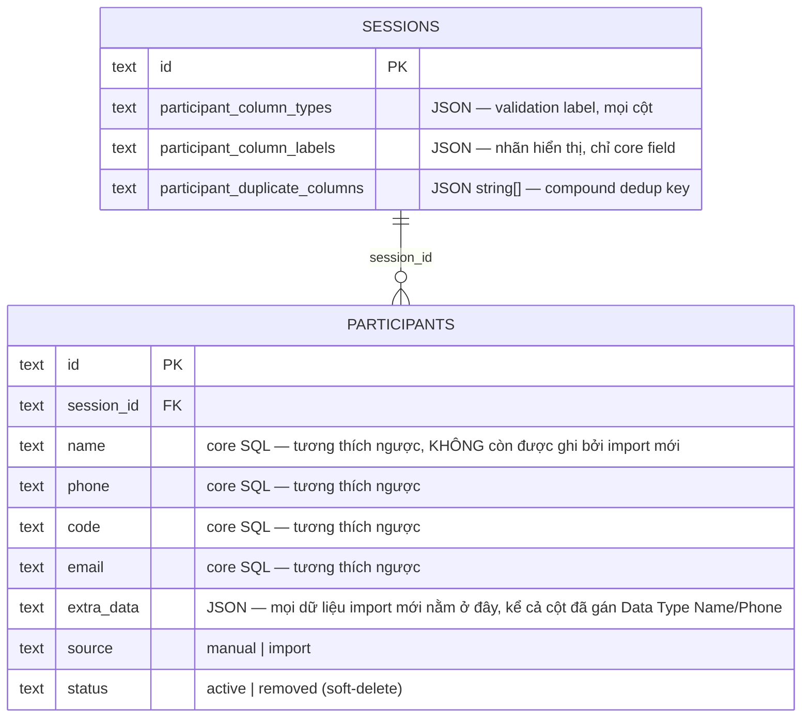

# Schema — participants & các cột liên quan ở sessions

## Bảng `participants`

```sql
CREATE TABLE participants (
  id TEXT PRIMARY KEY,
  session_id TEXT NOT NULL,   -- LUÔN lọc theo cột này ở mọi query/IPC mới
  code TEXT,
  name TEXT NOT NULL,         -- có thể là "" (chuỗi rỗng) — KHÔNG đồng nghĩa "đã có tên hợp lệ"
  phone TEXT,
  email TEXT,
  extra_data TEXT,            -- JSON — mọi cột "phụ", bao gồm dữ liệu import chưa được gán nhãn
  sort_order INTEGER,
  source TEXT DEFAULT 'manual',   -- 'manual' | 'import'
  status TEXT DEFAULT 'active',   -- 'active' | 'removed' (soft-delete)
  created_at TEXT DEFAULT (datetime('now'))
);
```

Lưu ý `name TEXT NOT NULL`: ràng buộc này chỉ cấm giá trị `NULL`, **không** cấm chuỗi rỗng `""`. Sau khi [import generic](./import.md), mọi dòng mới có `name = ""` **mãi mãi** — không có bước nào ghi lại vào cột này nữa (xem [column-mapping.md](./column-mapping.md), "Use as" đã bị bỏ). Đây là trạng thái hợp lệ, không phải lỗi ràng buộc DB; "Name" thật của participant giờ được xác định qua `resolveColumnForType`, không nhất thiết là cột SQL `name`.

## Mô hình 2 tầng field (core vs extra) — chỉ còn ý nghĩa LƯU TRỮ, không còn ý nghĩa "field thật"

- **Field cố định** (cột SQL thật): `name`, `phone`, `code`, `email`. Về mặt SCHEMA, đây vẫn là 4 cột SQL riêng — giữ nguyên để KHÔNG phá dữ liệu của session tạo từ trước khi có generic import (dữ liệu cũ vẫn nằm ở đây, vẫn đọc được bình thường).
- **Field optional**: mọi cột khác, gộp vào 1 cột JSON `extra_data`. Không có schema cố định — người dùng thêm/xoá/đổi tên tuỳ ý qua Data Editor, hoặc tự sinh ra từ import (xem [import.md](./import.md)).
- **Quan trọng — "core" không còn nghĩa là "quan trọng hơn" hay "field Draw Engine đọc"**: từ khi bỏ "Use as", việc participant nào có "Name" là gì được xác định ĐỘNG qua `participant_column_types` (`resolveColumnForType`/`resolveParticipantField`, xem [column-mapping.md](./column-mapping.md)), có thể trỏ vào 1 cột nằm trong `extra_data` chứ không nhất thiết là cột SQL `name`. Draw Engine (thuật toán CHỌN ai trúng) chưa bao giờ đọc field nào trong 2 nhóm này — chỉ dùng `id`/`status` (xem [`docs/architecture/draw-engine.md`](../architecture/draw-engine.md)); phần ĐỌC field cố định trước đây (để hiển thị) giờ cũng đã đổi sang đọc động.

## Cột liên quan ở `sessions` (per-session config cho Data Editor)

```sql
-- đã có sẵn từ đầu
landing_config TEXT              -- JSON LandingConfig (không liên quan participants)

-- thêm qua các migration ở db.ts, mỗi cột phục vụ đúng 1 khái niệm — xem column-mapping.md
participant_column_types TEXT        -- JSON { [tênCột]: ColumnType } — Name/Phone/Email/Code/URL/Text, mọi cột
participant_column_labels TEXT       -- JSON { [tênCột]: "Nhãn hiển thị" } — chỉ đổi tên hiển thị core field
participant_duplicate_columns TEXT   -- JSON string[] — KHÔNG CÒN DÙNG (xem ghi chú bên dưới)
```

Cả 3 cột đều là JSON dạng text, per-session (khác session khác cấu hình), migration idempotent theo đúng pattern chung của `db.ts` (`ALTER TABLE ... ADD COLUMN` nếu chưa có, không bao giờ `DROP`).

`participant_duplicate_columns` từng lưu cột dùng làm compound key khi Remove duplicate rows — đã bỏ khỏi app (renderer không còn ghi/đọc, IPC `sessions:updateDuplicateColumns` đã xoá) vì việc xác định trùng lặp giờ LUÔN lấy trực tiếp từ cột đang bôi chọn trên bảng (`targetColumns`), không còn config nào lưu riêng nữa — xem [column-mapping.md](./column-mapping.md#trùng-lặp-duplicate--cũng-tách-riêng-và-luôn-live-theo-selection). Cột DB vẫn giữ nguyên trong schema (không `DROP`, tránh phá dữ liệu cũ), chỉ là không còn ý nghĩa với code hiện tại.

**`participant_column_types` giờ mang 2 vai trò** (xem [column-mapping.md](./column-mapping.md)): nhãn validation (như từ đầu) VÀ nguồn xác định "cột nào là Name/Phone/Code/Email thật" cho Draw Engine/Winner Name/Scoreboard đọc động — không cần thêm cột DB nào khác cho việc này, vì không có dữ liệu nào bị DI CHUYỂN cả (khác thiết kế "Use as" ban đầu đã bỏ).

## Sơ đồ quan hệ



## Việc cần hỏi lại trước khi đổi schema

Theo quy tắc chung của repo (`CLAUDE.md`): mọi thay đổi cấu trúc bảng `participants`/`sessions` phải kèm migration an toàn (xem các hàm `migrate...()` cuối `db.ts` làm mẫu), không `DROP`/`ALTER` phá dữ liệu người dùng đã có, và hỏi lại người dùng trước khi làm.
